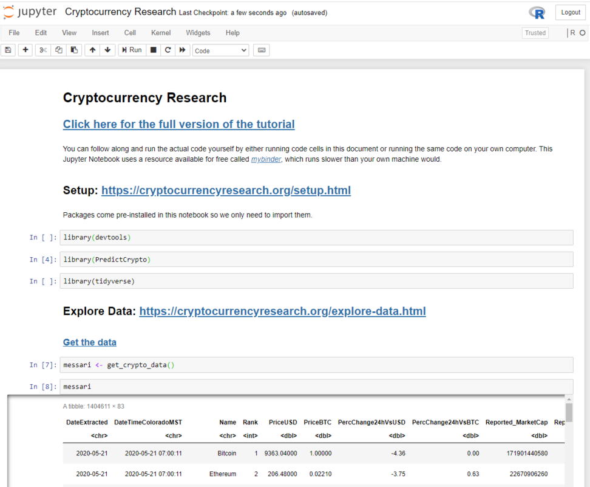
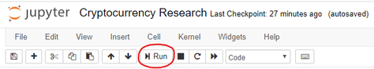
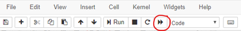
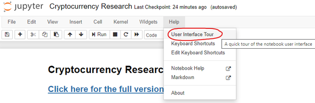
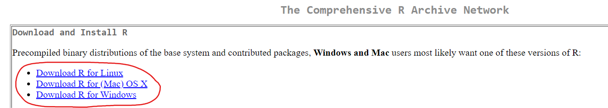
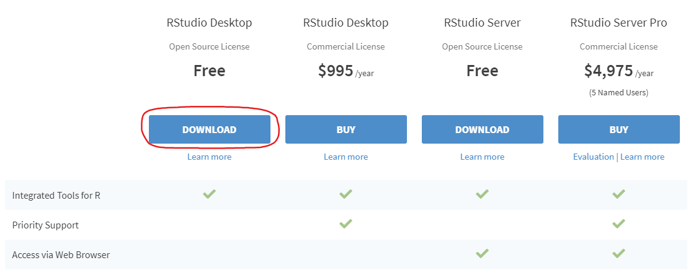

# Setup and Installation {#setup}

Every part of this document can be run on any computer that has R installed 


You can also follow along with the tutorial without running the individual steps yourself. In that case, [**you can move on to the next page where the tutorial actually begins**](#overview).

## Option 1 - Run in the Cloud

If you do not currently have R and RStudio installed on your computer, you can run all of the code in a jupyter notebook using an R kernel that we have made available online in <a href="https://gesis.mybinder.org/binder/v2/gh/ries9112/Research-Paper-Example/0a23077a85848af214976c87d7d5d2472df700ee?filepath=Jupyter%2FCryptocurrency%20Research.ipynb" target="_blank">**this mobile friendly link**</a>.

This can take up to 30 seconds to load, and once it has you should see a page that looks like this:



**From here, you can run the code one cell at a time:**



*You can also use `Shift` + `Enter` to run an individual code cell*

**Or run all code cells at once (recommended):**



**If you feel lost, you can do a quick interactive walkthrough under *Help --\> User Interface Tour*:**



## Option 2 - Run Locally

If you want to follow along from your own computer directly (recommended option), please follow the installation instructions below. Afterwards, you will be able to run the code. You only need to follow these instructions **once**. If you have followed these steps once already, [**skip ahead to the next section**](#overview).

### Setup R

Hopefully you already have **R** and **RStudio** installed on your computer.

If you don't have these two programs installed, you will need to:

1.  [**Install R**](https://cran.revolutionanalytics.com/).



2.  [**Install RStudio**](https://rstudio.com/products/rstudio/download/). This step is optional, but it is very recommended that you use an integrated development environment [(IDE)](https://en.wikipedia.org/wiki/Integrated_development_environment) like RStudio as you follow along, rather than using the R console as it was installed in step 1 above.



## Installing and Loading Packages {#installing-and-loading-packages}

[ADD HERE] describe how to install packages, what they are, etc... like high-level version.

```{r install_pacman, eval=F}
install.packages('pacman')
```

Load pacman:

```{r load_pacman}
library(pacman)
```

Install other packages:

```{r install_all_other_packages}
p_load('pins','tidyverse','skimr','tsibble','doParallel','DT', 'caret','anytime', # Data Exploration + Data Prep
       'ggTimeSeries','gifski','av', 'magick', 'ggthemes', 'plotly', 'ggpubr', # VIsualization
       'ggforce','gganimate', 'transformr', # Visualization continued
       'xgboost','gbm','deepnet') # Predictive Modeling
```

Nice work! Now you have everything you need to [follow along with this example](#overview).


### GitHub Repository

Because this document is produced through a **C**ontinuous **I**ntegration (CI) tool called **GitHub Actions**, it is also really easy for anyone to use the same code on their own computer to produce this document using the latest available data.

If you wanted to render this document in its entirety yourself, here is how you would do it:

<!-- [TODO - ADD STEPS HERE] -->

1. First

2. Second

3. ...


