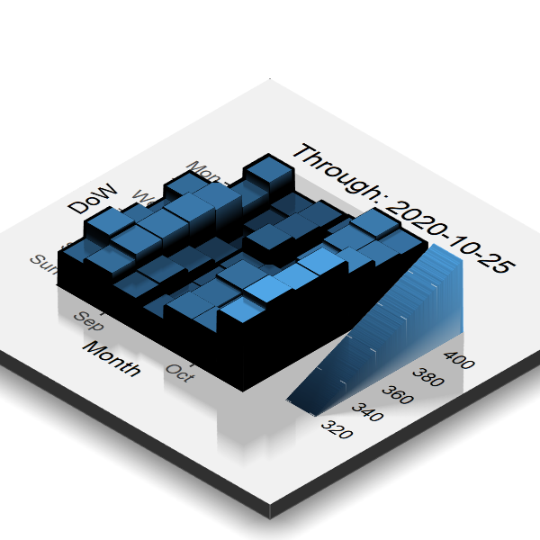

# Visualization `r emo::ji('chart_decreasing')`


<!-- NOTE 09/27: REVAMP THIS SECTION, ANSWER QUESTIONS ABOUT THE DATA MORE -->


<!-- NOTE 05/24: I'm thinking should calculate % change just for visualization purposes just here, but what if we avoid that completely and instead make the tutorial on visualizing price over time for BTC first and then creating gganimate tutorial to iterate over the rest? Just keep it to ggplot2 + extensions + gganimate tutorial here, no need to make a million visualizations. Would be good to add rayshader too, but add that as a stretch goal for later. -->

Making visualizations using `ggplot2` is one of the very best tools available in the R ecosystem. The ***gg*** in `ggplot2` stands for the ***Grammar of Graphics***, which is essentially the idea that many different types of charts share the same underlying building blocks, and that they can be put together in different ways to make charts that look very different from each other. [In Hadley's own words,](https://qz.com/1007328/all-hail-ggplot2-the-code-powering-all-those-excellent-charts-is-10-years-old/) "a pie chart is just a bar chart drawn in polar coordinates", "They look very different, but in terms of the grammar they have a lot of underlying similarities."


## Basics - ggplot2

So how does `ggplot2` actually work? ***"...in most cases you start with `ggplot()`, supply a dataset and aesthetic mapping (with `aes()`). You then add on layers (like `geom_point()` or `geom_histogram()`), scales (like `scale_colour_brewer()`), faceting specifications (like `facet_wrap()`) and coordinate systems (like `coord_flip()`)."*** - [ggplot2.tidyverse.org/](https://ggplot2.tidyverse.org/).

Let's break this down step by step.

***"start with ggplot(), supply a dataset and aesthetic mapping (with aes())***


```{r ggplot_blank}
ggplot(data = cryptodata, aes(x = date_time_utc, y = price_usd))
```


The chart now shows up but is blank because we need to perform an additional step ***"You then add on layers (like `geom_point()` or `geom_histogram()`)..."***

We can take the exact same code as above and add ***+ `geom_point()`***

```{r ggplot_geom_point}
ggplot(data = cryptodata, aes(x = date_time_utc, y = price_usd)) +
       # adding geom_point():
       geom_point()
```

The most expensive cryptocurrency being shown, `r subset(cryptodata, price_usd == max(cryptodata$price_usd))$symbol` in this case, makes it difficult to take a look at any of the other ones. Let's try *zooming-in* on a single one by using the same code but making an adjustment to the `data` parameter to only show data for the cryptocurrency with the symbol *ETH*, first let's filter the data down to those results only:
```{r ETH_subset}
eth_data <- subset(cryptodata, symbol == 'ETH')
```

```{r ggplot_ETH}
ggplot(data = eth_data, 
       aes(x = date_time_utc, y = price_usd)) + 
       geom_point()
```

*The axis automatically adjusted to the new data.*

This is better, but geom_point() might not be the best choice for this chart, let's change `geom_point` with `geom_line` and see what that looks like:

```{r ggplot_ETH_line}
ggplot(data = eth_data, 
       aes(x = date_time_utc, y = price_usd)) + 
       # changing geom_point() into geom_line():
       geom_line()
```

Let's save the results as an object called `crypto_chart`:
```{r}
crypto_chart <- ggplot(data = eth_data, 
                       aes(x = date_time_utc, y = price_usd)) + 
                       geom_line()
```

We can add a line showing the trend over time:

```{r ggplot_ETH_lm_relationship}
crypto_chart <- crypto_chart + stat_smooth()
crypto_chart
```

One particularly nice aspect of using the ggplot framework, is that we can keep adding as many elements and transformations to the chart as we would like with no limitations. 

We will not save the next result, but to illustrate this point, we can add a new line showing a linear regression fit going through the data using `stat_smooth(method = 'lm')`. And let's also show the individual points in green to show we can keep layering things as much as we want.

```{r}
crypto_chart + 
        # Add linear regression line
        stat_smooth(method = 'lm', color='red') + 
        # Add points
        geom_point(color='dark green', size=0.8)
```

By not providing any `method` option, the `stat_smooth()` function defaults to use the `method` called [`loess`, which shows trends more locally](https://www.rdocumentation.org/packages/stats/versions/3.6.2/topics/loess), while the `lm` model fits the best fitting linear regression line.

Of course we can add other components that make a visualization effective, let's add labels to the chart now:
```{r ggplot_labels}
crypto_chart <- crypto_chart +
                  ggtitle(paste('Price Change Over Time -', eth_data$symbol),
                          subtitle = paste('Most recent data collected on:', max(eth_data$date_time_utc))) + 
                  xlab('Date Time (UTC)') +
                  ylab('Price ($)')
# display the new chart
crypto_chart
```

The `ggplot2` package comes with a large amount of functionality. You can find a full reference of the functions you can use here:

```{r show_ggplot2_ref, echo=F}
knitr::include_url("https://ggplot2.tidyverse.org/reference/")
```
*https://ggplot2.tidyverse.org/reference/*


What makes the `ggplot2` package **even better** is the fact that [it also comes with a framework for anyone to develop their own extensions](https://cran.r-project.org/web/packages/ggplot2/vignettes/extending-ggplot2.html). Meaning there is a lot more functionality that the community has created that can be added in importing other packages that provide extensions to ggplot.

## Using Extensions

### ggthemes

To use an extension, we just need to import it into our R session like we did with `ggplot2` and the rest of the packages we want to use. We [already loaded the `ggthemes` [@R-ggthemes] package in the Setup section](#setup) so we do not need to run `library(ggthemes)` to import the package into the session.

We can apply a *theme* to the chart now and change the way it looks:

```{r ggthemes, message=FALSE, warning=FALSE}
crypto_chart <- crypto_chart + theme_economist()
# display the new chart
crypto_chart
```

See below for a full list of themes you can test. If you followed to this point try running the code `crypto_chart + theme_excel()` or any of the other options listed below instead of `+ theme_excel()`:
```{r show_ggthemes_site, echo=F}
knitr::include_url("https://yutannihilation.github.io/allYourFigureAreBelongToUs/ggthemes/")
```
*https://yutannihilation.github.io/allYourFigureAreBelongToUs/ggthemes/*


### plotly
In some cases, it's helpful to make a chart responsive to a cursor hovering over it. We can convert any ggplot into an interactive chart by using the `plotly` [@R-plotly] package, and it is super easy!

We already imported the `plotly` package [in the setup section](#setup), so all we need to do is wrap our chart in the function `ggplotly()`:

<!-- CAUSES ISSUES 06/11 -->
```{r plotly, message=FALSE, warning=FALSE}
ggplotly(crypto_chart) # notice that we did not overwrite the crypto_chart object this time
```

If you are not looking to convert a ggplot, plotly also provides its own framework for making charts from scratch, you can find out more about it here:
```{r show_plotly_website, echo=F}
knitr::include_url("https://plotly.com/r/")
```
***https://plotly.com/r/***

<!-- NOT WORKING ANYMORE ON 10/21/2020: -->
### ggpubr

The `ggpubr` [@R-ggpubr] extension provides a lot of functionality that we won't cover here, but one function we can use from this extension is `stat_cor()`, which allows us to add a correlation coefficient (R) and p-value to the chart.

```{r ggpubr, message=FALSE, warning=FALSE, error=TRUE}
crypto_chart <- crypto_chart + stat_cor()
# Show chart
crypto_chart
```

We will dive deeper into these metrics in [the section where we evaluate the performance of the models](#evaluate-model-performance).

### ggforce

The `ggforce` package [@R-ggforce] is a useful tool for annotating charts. We can annotate outliers for example:

```{r add_ggforce_annotations, error=TRUE}
crypto_chart <- crypto_chart +
                  geom_mark_ellipse(aes(filter = price_usd == max(price_usd),
                          label = date_time_utc,
                          description = paste0('Price spike to $', price_usd))) +
                  geom_mark_ellipse(aes(filter = price_usd == min(price_usd),
                          label = date_time_utc,
                          description = paste0('Price drop to $', price_usd)))
```

Now view the new chart:
```{r}
crypto_chart
```

When using the `geom_mark_ellipse()` function we are passing the `data` argument, the `label` and the `description` through the `aes()` function. We are marking two points, one for the minimum price during the time period, and one for the maximum price. For the first point we filter the data to only the point where the `price_usd` was equal to the `max(price_usd)` and add the labels accordingly. The same is done for the second point, but showing the lowest price point for the given date range.

### gganimate

<!-- LOOK THROUGH THIS AND PUT THE PRICE OVER TIME CHART AND THE RELATIONSHIP BETWEEN PREVIOUS PRICE AND NEXT 24H PRICE SIDE BY SIDE, AND HAVE THEM ANIMATED ITERATING OVER ALL CRYPTOCURRENCIES: https://github.com/thomasp85/gganimate/wiki/Animation-Composition -->

<!-- DISABLED CODE BELOW BECAUSE OF AN ERROR "trasnformr is required to tween paths and lines" -->

We can repeat the same steps on the complete dataset, and then animate the results for each of the groups. Here is the first chart again, animated based on the groupings we created in the previous section:
```{r first_gganimate, message=FALSE, warning=FALSE, error=TRUE}
animated_prices <- ggplot(data = mutate(cryptodata, groups=symbol),
                          aes(x = date_time_utc, y = price_usd)) +
                          geom_point() +
                          transition_states(groups) +
                          stat_smooth() +
                          ggtitle('Price Over Time',subtitle = '{closest_state}') +
                          view_follow() # this adjusts the axis based on the group
# Show animation:
animated_prices
```

We can slow down the animation by using `animate()` and choosing the speed in terms of the frames per second (`fps`)"
```{r gganimate_speed, message=FALSE, warning=FALSE, error=TRUE}
animated_prices_result <- animate(animated_prices,fps=1)
# show slowed down results
animated_prices_result
```

<!-- More animate options: -->
<!-- animate( -->
<!--     plot = my_plot, -->
<!--     render = gifski_renderer(), -->
<!--     height = 600, -->
<!--     width = 800,  -->
<!--     duration = 5, -->
<!--     fps = 20) -->


<!-- COMMENTED OUT BECAUSE WAS USING PRICE INSTEAD OF % CHANGE -->
<!-- ### gghiglight -->

<!-- Instead of iterating over each cryptocurrency one at a time like we did with the animation above, we might want to get a better side-by-side view of all our groups. -->

<!-- The `gghighlight` [@R-gghighlight] package lets us plot all groups on the same chart, and highlight the series we are interested in. -->

<!-- For example, we can plot the percentage change in price over a 24 hour period for all cryptocurrencies, and highlight those we are interested in to compare them against the rest of the trends. -->
<!-- ```{r gghighlight_percent_change, message=FALSE, warning=FALSE} -->
<!-- library(gghighlight) -->
<!-- ggplot(cryptodata, -->
<!--        aes(x=date_time_utc, y=((sell_price_usd_24h_later - price_usd)/price_usd) * 100, colour=symbol)) + -->
<!--   geom_line() + -->
<!--   ylab('Next 24 hours % Price Change') + -->
<!--   gghighlight(symbol=='Bitcoin') -->
<!-- ``` -->


### Calendar Heatmap

For this kind of timeseries data, another nice view we can take of the data is a calendar heatmap, by using the package `ggTimeSeries` [@R-ggTimeSeries]:
```{r ggtimeseries_heatmap, error=TRUE}
calendar_heatmap <- ggplot_calendar_heatmap(eth_data,'date_time_utc','price_usd') #or do target_percent_change here?
calendar_heatmap
```

*DoW on the y-axis stands for Day Of the Week*

To read this chart in the correct date order start from the top left and work your way down and to the right once you reach the bottom of the column. The lighter the color the higher the price on the specific day.

### Rayshader

The previous chart is helpful, but a color scale like that can be a bit difficult to interpret. We could convert the previous chart into a 3d figure that is easier to visually interpret by using the amazing `rayshader` [@R-rayshader] package. 

**This document runs automatically through GitHub Actions, which [does not have a graphical environment to run the code below](https://github.community/t/installation-of-xquartz-not-found/139804), which prevents it from refreshing the results with the latest data. We are showing old results for the Rayshader section below. If you have gotten to this point, run the code below yourself on the latest data to see this amazing package in action!**

```{r rayshader_cal_heatmap, eval=FALSE}
# First remove the title from the legend to avoid visual issues
calendar_heatmap <- calendar_heatmap + theme(legend.title = element_blank())
# Add the date to the title to make it clear these refresh twice daily
calendar_heatmap <- calendar_heatmap + ggtitle(paste0('Through: ',substr(max(eth_data$date_time_utc),1,13)))
# Convert to 3d plot
plot_gg(calendar_heatmap, zoom = 0.60, phi = 35, theta = 45)
# Render snapshot
render_snapshot('rayshader_image.png')
# Close RGL (which opens on plot_gg() command in a separate window)
rgl.close()
```



This is the same two dimensional [calendar heatmap that was made earlier](#calendar-heatmap).

Because we can programmatically adjust the camera as shown above, that means that we can also create a snapshot, move the camera and take another one, and keep going until we have enough to make it look like a video! This is not difficult to do using the `render_movie()` function, which will take care of everything behind the scenes for the same plot as before:
```{r rayshader_render_movie, eval=FALSE}
# This time let's remove the scale too since we aren't changing it:
calendar_heatmap <- calendar_heatmap + theme(legend.position = "none")
# Same 3d plot as before
plot_gg(calendar_heatmap, zoom = 0.60, phi = 35, theta = 45)
# Render movie
render_movie('rayshader_video.mp4')
# Close RGL
rgl.close()
```

*Click on the video below to play the output*


Awesome! Move on to the [next section](#predictive-modeling) to start making predictive models for the data, or keep reading below to learn more about ggplot2 extensions.


<!-- ### ggmap -->

<!-- (could probably get rid of this, cool but not super relevant) -->


<!-- There are so many different extensions for ggplot that it feels like a disservice to not be able to cover them all, so in order to show just how creative you can get, here is one last example using the `ggmap` [@R-ggmap] package. -->

<!-- ```{r import_ggmap, message=FALSE, warning=FALSE} -->
<!-- library(ggmap) -->
<!-- ``` -->

<!-- ```{r google_key, include=F} -->
<!-- register_google(gs_key) -->
<!-- ``` -->

<!-- Let's create a ggplot with the latest Google Maps satellite image of one of the towns in Russia where cryptocurrency mining facilities are prevalent. It is not easy to keep a massive facility with many powerful computers cool, so naturally very cold places like this are ideal to help keep electricity costs down. -->

<!-- ```{r show_google_map} -->
<!-- ggmap(get_map('Bratsk Russia', zoom=15, maptype='hybrid')) -->
<!-- ``` -->

<!-- We can take a slightly different view of the same location: -->

<!-- ```{r show_google_map_zoomed} -->
<!-- ggmap(get_map('Bratsk Russia', zoom=13, maptype='satellite')) -->
<!-- ``` -->

<!-- Or we could enter coordinates for a location directly instead of doing a search, here is Area 51 in Nevada for example:
<!-- ```{r}
<!-- ggmap(get_map(c(lon=-115.81, lat=37.2431), zoom=15, maptype='satellite'))
<!-- ```

If you wanted to use `ggmaps`, unfortunately this tool will require you to create your own API key through Google and connect it using `register_google()` and passing the API key to the function, before you can start returning maps. [Click here to find out more about ggmaps and getting it setup on your device, which is straightforward](https://github.com/dkahle/ggmap).

<!-- IMPORTANT: THE TUTORIAL IN THIS SECTION SHOULD MAINLY CONSIST OF GGPLOT FUNCTIONALITY, INTRODUCING EXTENSIONS, ANNOTATING CHARTS WITH GGFORCE, CREATING ANIMATIONS WITH GGANIMATE, PUTTING MULTIPLE ONES TOGETHER USING PATCHWORK.
<!-- ALSO FOCUS ON HOW DO YOU PLOT GROUPS OF DATA AS WELL AS TIMESERIES DATA, WORTH MENTIONING GGHIGHLIGHT AS WELL AS USING REGULAR FACETS, OR PLUGGING DATA INTO TRELLISCOPE.


<!-- ### Other ways to explore grouped data -->

<!-- Instead of iterating over each cryptocurrency one at a time like we did with the animation above, we might want to get a better side-by-side view of all our groups.  -->

<!-- #### gghiglight -->

<!-- The `gghighlight` [@R-gghighlight] package lets us plot all groups on the same chart, and highlight the series we are interested in.  -->

<!-- For example, we can plot the percentage change in price over a 24 hour period for all cryptocurrencies, and highlight those we are interested in to compare them against the rest of the trends. -->
<!-- ```{r gghighlight_percent_change, message=FALSE, warning=FALSE} -->
<!-- library(gghighlight) -->
<!-- ggplot(cryptodata,  -->
<!--        aes(x=date_time_utc, y=((sell_price_usd_24h_later - price_usd)/price_usd) * 100, colour=symbol)) + -->
<!--   geom_line() + -->
<!--   ylab('Next 24 hours % Price Change') + -->
<!--   gghighlight(symbol=='Bitcoin') -->
<!-- ``` -->


<!-- <!-- Rayshader here? -->


<!-- <!-- END HERE, ADD REST OF SECTIONS ABOVE: -->

<!-- ### More Extensions -->

<!-- We only scratched the surface of what is possible, and new tools are frequently developed by the community.  -->

<!-- ***You can explore the large number of ggplot2 extensions here:*** -->
<!-- ```{r show_ggplot_extensions_website, echo=F} -->
<!-- knitr::include_url("https://exts.ggplot2.tidyverse.org/gallery/", -->
<!--   height = "600px") -->
<!-- ``` -->

<!-- ***You could even write your own extensions:*** -->
<!-- ```{r show_ggplot_extensions_make_your_own, echo=F} -->
<!-- knitr::include_url("https://ggplot2-book.org/extensions.html", -->
<!--   height = "600px") -->
<!-- ``` -->


<!-- NEW CODE BELOW, DON'T DELETE: -->


<!-- For this section, let's use the object `cryptodata` instead of `crypto_grouped`, which is what will be used in the [next section for the predictive modeling](#predictive-modeling). The non-grouped object will be easier to work with for the visualizations. -->

<!-- The first thing we can do, is visualize the target % change over time for our data across the different cryptocurrencies. We will use the `ggplot2` package, which is part of the `tidyverse` package that we already imported into the R session earlier, so we don't need to import `ggplot2` to use its functions. -->

<!-- Using `ggplot()`, we can build a chart by first specifying `ggplot(data, aes(x = [variable1], y = [variable2]))`, and then using the correct ***geom*** to decide how to plot the information. We can take the ggplot we just made and add `geom_line()` to show the target variable we calculated in [the previous section](#add-target) over time: -->

<!-- ```{r first_visualization} -->
<!-- ggplot(cryptodata, aes(x=date_time_utc, y=target_percent_change)) + -->
<!--   geom_line() -->
<!-- ``` -->

<!-- This chart however is not exactly useful. Which cryptocurrency is which? There are so many lines that they show up as big black blobs instead, which is not what we want. We can take the same chart, and within the `aes()` argument of `ggplot()` we can simply add the argument `colour=symbol` to add different colors to identify each cryptocurrency: -->

<!-- ```{r first_visualization_by_symbol} -->
<!-- ggplot(cryptodata, aes(x=date_time_utc, y=target_percent_change, colour=symbol)) + -->
<!--   geom_line() -->
<!-- ``` -->

<!-- This is even less useful than before because there are too many different cryptocurrencies. We can use the `gghighlight` package in order to just highlight the top 10 cryptocurrencies by rank instead. When working with ggplots, the whole idea is to build the chart piece by piece, and we will do something similar by simply adding `+ gghighlight([condition])` to the same exact code we just ran above: -->

<!-- ```{r first_visualization_by_symbol_gghighlight} -->
<!-- library(gghighlight) # not part of the tidyverse so needs to be loaded -->
<!-- ggplot(cryptodata, aes(x=date_time_utc, y=target_percent_change, colour=symbol)) + -->
<!--   geom_line() + -->
<!--   gghighlight(rank <= 5) -->
<!-- ``` -->

<!-- Now let's zoom in on things a bit: -->

<!-- ```{r first_visualization_by_symbol_gghighlight_zoom} -->
<!-- library(gghighlight) # not part of the tidyverse so needs to be loaded -->
<!-- ggplot(cryptodata, aes(x=date_time_utc, y=target_percent_change, colour=symbol)) + -->
<!--   geom_line() + -->
<!--   gghighlight(rank <= 5) + -->
<!--   scale_x_datetime(limits = c(Sys.time() - 10*60*60*10, Sys.time()-80000)) + -->
<!--   scale_y_continuous(limits = c(-10,10)) -->
<!-- ``` -->

<!-- Are these trends connected in any way? We can use the package `plotly`[@R-plotly] to wrap the same chart in the function `ggplotly` to make this chart interactive and get more information out of it. Click and drag to move the plot around and scroll within the chart to zoom in and out. -->
<!-- ```{r first_visualization_ggplotly} -->
<!-- library(plotly) -->
<!-- (ggplot(cryptodata, aes(x=date_time_utc, y=target_percent_change, colour=symbol)) + -->
<!--   geom_line() + -->
<!--   gghighlight(rank <= 5) + -->
<!--   scale_x_datetime(limits = c(Sys.time() - 10*60*60*10, Sys.time()-80000)) + -->
<!--   scale_y_continuous(limits = c(-10,10))) %>%  -->
<!--   ggplotly() -->
<!-- ``` -->


<!-- ## Rayshader -->

<!-- We can use the `Rayshader` package to create a 3d representation of a ggplot. We can first make a heatmap of the 24 hour target % change over time and assign it to the object `rayshader_plot`: -->

<!-- ```{r first_visualization_hex} -->
<!-- rayshader_plot <- ggplot(cryptodata, aes(x=date_time_utc, y=target_percent_change)) + geom_hex() -->
<!-- ``` -->

<!-- We can then wrap the result in `plot_gg()`: -->

<!-- ```{r first_rayshader} -->
<!-- library(rayshader) -->
<!-- plot_gg(rayshader_plot) -->
<!-- rgl::rglwidget() -->
<!-- ``` -->


<!-- NEW NOTES MAY -->

<!-- - Here could give more details around flipside FCAS ratings and compare groups to % target, could do it by cv_fold and gganimate -->

<!-- - gghighlight % change over time all cryptos, highlighting top 5 -->


<!-- REMEMBER TO LEVERAGE GGANIMATE AND RAYSHADER FOR THIS SECTION -->


<!-- OLD CODE BELOW -->


<!-- **Summary for discussion:** Having narrowed down the dataset to less but more interesting variables, we should be able to create some relatively interesting visualizations here. Doing so, relationships like the previous 24h % change to the target variable, become *extremely* obvious.  -->

<!-- We will introduce the idea that as a cryptocurrency trader there are limitations based on where you live, and whether the cryptocurrency is large enough to actually be found on an exchange that you can trade on. For example, Binance was by far the largest exchange in the US, but it became illegal for US citizens to trade on Binance in 2019, and people in the United States can now only trade on "Binance US", which offers a smaller selection of cryptocurrencies to trade on. **So,** the observed relationships that seem extremely strong when looking at the market as a whole are actually not nearly as strong when you look at an individual exchange that people in the US could actually trade on. -->

<!-- Therefore the section will end with the same visual exploration from the start of the section, but breaking things down by 4 exchanges, and calculating the % change in the prices using the prices found on those specific exchanges directly instead of the aggregated average reported price. These relationships will be much weaker than the illusion created by looking at the markets as a whole. The 4 exchanges would be KuCoin, HitBTC, BitMart and Bibox; these ones specifically, because I have web scrapers that collect the prices specific to these exchanges only. I could set more up, I just have these ones because I identified these as the best exchanges for me to do trades on using an automated strategy in terms of them working with the tools I am using and having a large variety of cryptocurrencies. -->

<!-- A good approach might be to explore 1 exchange only, and offer additional material around doing the same for the other 3 that people can use as they will. -->


<!-- Here just add just one example for now of one chart going over ggplot2 syntax and general idea (look at what I wrote for tutorials), add a theme to it, turn it into an interactive plot, then use rayshader on it (so probably best to do a hex which looks nice) -->


<!-- ```{r setupVisualization, echo=F, message=FALSE, warning=FALSE} -->
<!-- # setup here -->
<!-- # library(plotly) -->
<!-- # library(ggpubr) -->
<!-- # library(rayshader) -->
<!-- # library(gghighlight) -->
<!-- ``` -->


<!-- Let's take a first look at the data by looking at the price of different cryptocurrencies over time: -->

<!-- ```{r message=FALSE, warning=FALSE} -->
<!-- # library(gghighlight) -->
<!-- # ggplot(cryptodata, aes(x=date, y=price_usd, colour=symbol)) + -->
<!-- #   geom_line() + -->
<!-- #   gghighlight(symbol=='BTC'|symbol=='ETH') -->
<!-- ``` -->

<!-- Bitcoin (BTC) and Bitcoin (ETH) are highlighted using the `gghighlight` [@R-gghighlight] package. -->

<!-- <!-- ***Note for discussion: create custom plotting function or walk through ggplot code?*** --> 

<!-- It's hard to tell anything about the data from the previous view because of the differences in the range in prices ($). Let's take the log of the price and make the same chart: -->

<!-- <!-- ```{r message=FALSE, warning=FALSE} -->
<!-- <!-- ggplot(cryptodata, aes(x=date, y=log(price_usd), colour=symbol)) + --> 
<!-- <!--   geom_line() + -->
<!-- <!--   gghighlight(symbol=='BTC'|symbol=='ETH'|symbol=='MANA') --> 
<!-- <!-- ``` -->


<!-- CREATE CUSTOM FUNCTION TO CREATE THIS PLOT PLOT_price_usd(log_price=TRUE) - OR BETTER TO LEAVE AS IS? -->


<!-- ```{r visualize_target_percent_change, warning=FALSE} -->
<!-- ggplot(cryptodata, aes(x=date, y=target_percent_change, colour=symbol)) + -->
<!--   geom_point() + -->
<!--   ylim(c(-20,20))  + -->
<!--   geom_smooth(method = "loess", colour='blue') + -->
<!--   gghighlight(symbol=='ETH') -->
<!-- ``` -->


<!-- Rayshader example: -->
<!-- ```{r} -->
<!-- plot_gg(ggplot(subset(cryptodata,symbol=='BTC'), aes(x=date, y=fees_daily_mean_usd, colour=fees_daily_median_usd)) + -->
<!--   geom_point() ) -->
<!-- ``` -->


<!-- REMEMBER TO LEVERAGE GGANIMATE AND RAYSHADER FOR THIS SECTION -->


<!-- OLD V2 BELOW: -->


<!-- ### Calendar heatmap -->

<!-- ```{r} -->
<!-- # From https://towardsdatascience.com/time-series-calendar-heatmaps-9f576578fcfe -->
<!-- library(plyr) -->
<!-- library(plotly) -->
<!-- library(tidyquant) -->
<!-- poloniex_btc_calendar <- poloniex_btc -->
<!-- poloniex_btc_calendar$weekday = as.POSIXlt(poloniex_btc_calendar$date)$wday +1 #finding the day no. of the week -->
<!-- poloniex_btc_calendar$weekdayf<-factor(poloniex_btc_calendar$weekday,levels=rev(1:7),labels=rev(c("Mon","Tue","Wed","Thu","Fri","Sat","Sun")),ordered=TRUE) #converting the day no. to factor -->
<!-- poloniex_btc_calendar$monthf<-factor(month(poloniex_btc_calendar$date),levels=as.character(1:12),labels=c("Jan","Feb","Mar","Apr","May","Jun","Jul","Aug","Sep","Oct","Nov","Dec"),ordered=TRUE) # finding the month -->
<!-- poloniex_btc_calendar$yearmonth<- factor(as.yearmon(poloniex_btc_calendar$date)) #finding the year and the month from the date. Eg: Nov 2018 -->
<!-- poloniex_btc_calendar$week <- as.numeric(format(poloniex_btc_calendar$date,"%W")) #finding the week of the year for each date -->
<!-- poloniex_btc_calendar<-ddply(poloniex_btc_calendar,.(yearmonth),transform,monthweek=1+week-min(week)) #normalizing the week to start at 1 for every month -->

<!-- poloniex_btc_calendar$year <- substr(poloniex_btc_calendar$date,1,4) -->
<!-- poloniex_btc_calendar <- filter(poloniex_btc_calendar, year > 2016) -->

<!-- price_heatmap <- ggplot(poloniex_btc_calendar, aes(monthweek, weekdayf, fill = poloniex_btc_calendar$price_usd)) + geom_tile(colour = "white") + facet_grid(year(poloniex_btc_calendar$date)~monthf) + scale_fill_gradient(low="red", high="green") + xlab("Week of Month") + ylab("") + ggtitle("Time-Series Calendar Heatmap: BTC Price ($)") + labs(fill = "Price") -->


<!-- #price_heatmap -->
<!-- plot_gg(price_heatmap) -->
<!-- ``` -->


<!-- Does the previous 24h % change affect the outcome of the % change for the next 24 hours? -->

<!-- ```{r targetVsChange, warning=F} -->
<!-- # adjust this to be a heatmap/different look instead -->
<!-- ggplot(poloniex_btc, aes(x=change_percent, y=target_perc_change)) + -->
<!--   geom_point(color='deepskyblue4', size=1.5) + -->
<!--   xlim(c(-20,20)) + -->
<!--   ylim(c(-20,20)) + -->
<!--   stat_cor(label.x = -20, label.y = 20) + -->
<!--   stat_regline_equation(label.x = -20, label.y = 17) + -->
<!--   labs(title='Relationship between previous 24h % change and next 24h % change vs. USD', -->
<!--        x='Previous 24h % Change', y= 'Next 24h % Change (Target)') + -->
<!--   geom_smooth(color = 'lightcoral', method = 'lm') -->
<!-- ``` -->


<!-- Same chart but filtered down to Bitcoin only: -->

<!-- ```{r targetVsChangeBTC, warning=F} -->
<!-- # adjust this to be a heatmap/different look instead -->
<!-- ggplot(filter(investing_dot_com,symbol=='BTC'), aes(x=change_percent, y=target_perc_change)) + -->
<!--   geom_point(color='deepskyblue4', size=1.5) + -->
<!--   xlim(c(-20,20)) + -->
<!--   ylim(c(-20,20)) + -->
<!--   stat_cor(label.x = -20, label.y = 20) + -->
<!--   stat_regline_equation(label.x = -20, label.y = 17) + -->
<!--   labs(title='Relationship between previous 24h % change and next 24h % change vs. USD', -->
<!--        x='Previous 24h % Change', y= 'Next 24h % Change (Target)') + -->
<!--   geom_smooth(color = 'lightcoral', method = 'lm') -->
<!-- ``` -->


<!-- Same chart but filtered down to Bitcoin only: -->

<!-- ```{r targetVsChangeETH, warning=F} -->
<!-- # adjust this to be a heatmap/different look instead -->
<!-- ggplot(filter(investing_dot_com,symbol=='ETH'), aes(x=change_percent, y=target_perc_change)) + -->
<!--   geom_point(color='deepskyblue4', size=1.5) + -->
<!--   xlim(c(-20,20)) + -->
<!--   ylim(c(-20,20)) + -->
<!--   stat_cor(label.x = -20, label.y = 20) + -->
<!--   stat_regline_equation(label.x = -20, label.y = 17) + -->
<!--   labs(title='Relationship between previous 24h % change and next 24h % change vs. USD', -->
<!--        x='Previous 24h % Change', y= 'Next 24h % Change (Target)') + -->
<!--   geom_smooth(color = 'lightcoral', method = 'lm') -->
<!-- ``` -->


<!-- ## Percent Change in Price Vs. USD Over Time -->

<!-- First convert the data to a `tsibble` which is a specialized data type that makes working with timeseries data more effective -->

<!-- ```{r paged.print=TRUE} -->
<!-- library(tsibble) -->
<!-- coin_metrics$date <- as.Date(coin_metrics$date_time_utc) -->
<!-- coin_metrics_tsbl <- as_tsibble(coin_metrics, key = symbol, index = date) -->
<!-- datatable(head(coin_metrics_tsbl,1000)) -->
<!-- ``` -->

<!-- Same deal with the other table: -->
<!-- ```{r} -->
<!-- coin_metrics$date <- as.Date(coin_metrics$date_time_utc) -->
<!-- coin_metrics_tsbl <- as_tsibble(coin_metrics, key = symbol, index = date) -->
<!-- datatable(head(coin_metrics_tsbl,1000)) -->
<!-- ``` -->


<!-- ## Find outliers -->

<!-- ```{r} -->
<!-- library(brolgar) -->
<!-- min_max <- poloniex_btc %>% -->
<!--   ungroup() %>% -->
<!--   filter(near_quantile(target_perc_change, c(0,1), 0.01)) -->
<!-- gg_id_features_red_dots <- -->
<!--   ggplot(poloniex_btc, -->
<!--          aes(x = date_time_utc, -->
<!--              y = target_perc_change)) + -->
<!--   geom_point(data = min_max, -->
<!--              colour = "#c03018", -->
<!--              size = 6) + -->
<!--   geom_point() -->
<!-- gg_id_features_red_dots -->
<!-- ``` -->


<!-- ```{r} -->
<!-- gg_id_features_red_dots_only <- -->
<!-- ggplot(min_max, -->
<!--        aes(x = date_time_utc, -->
<!--            y = target_perc_change, -->
<!--            group = symbol)) + -->
<!--   geom_point(colour = "#c03018", -->
<!--              size = 6) + -->
<!--   geom_point() -->
<!-- gg_id_features_red_dots_only -->
<!-- ``` -->


<!-- ```{r} -->
<!-- library(ggrepel) -->
<!-- gg_id_features_red_dots_only + -->
<!--   geom_label_repel(colour = "#c03018", -->
<!--              aes(label = as.character(date)), -->
<!--              size = 5, -->
<!--              nudge_x = -10) -->
<!-- ``` -->


<!-- ## Correlations -->


<!-- Select numeric variables: -->

<!-- ```{r} -->
<!-- poloniex_btc_correlations <- dplyr::select_if(poloniex_btc, is.numeric) -->
<!-- ``` -->

<!-- Calculate correlation: -->

<!-- ```{r} -->
<!-- poloniex_btc_correlations <- cor(poloniex_btc_correlations, use="complete.obs") -->
<!-- #btc_correlations <- as.data.frame(btc_correlations) -->
<!-- #btc_correlations %>% select(target_perc_change) %>% round(2) -->
<!-- ``` -->

<!-- ```{r} -->
<!-- library(ggcorrplot) -->
<!-- ggcorrplot(poloniex_btc_correlations) -->
<!-- ``` -->

<!-- ```{r} -->
<!-- library(reshape2) -->
<!-- melted_btc_correlations <- melt(poloniex_btc_correlations) -->
<!-- head(melted_btc_correlations) -->
<!-- ``` -->

<!-- ```{r} -->
<!-- melted_btc_correlations <- filter(melted_btc_correlations, Var2=='target_perc_change') -->
<!-- ggplot(data = melted_btc_correlations, aes(x=Var1, y=Var2, fill=value)) + -->
<!--   geom_tile() -->
<!-- ``` -->


<!-- ```{r} -->
<!-- # plot_gg(ggplot(data = melted_btc_correlations, aes(x=Var1, y=Var2, fill=value)) + -->
<!-- #   geom_tile()) -->
<!-- ``` -->


<!-- ```{r} -->
<!-- # Get lower triangle of the correlation matrix -->
<!--   get_lower_tri<-function(cormat){ -->
<!--     cormat[upper.tri(cormat)] <- NA -->
<!--     return(cormat) -->
<!--   } -->
<!--   # Get upper triangle of the correlation matrix -->
<!--   get_upper_tri <- function(cormat){ -->
<!--     cormat[lower.tri(cormat)]<- NA -->
<!--     return(cormat) -->
<!--   } -->

<!-- upper_tri <- get_upper_tri(poloniex_btc_correlations) -->
<!-- upper_tri -->

<!-- # Melt the correlation matrix -->
<!-- library(reshape2) -->
<!-- melted_btc_correlations <- melt(upper_tri, na.rm = TRUE) -->
<!-- melted_btc_correlations <- filter(melted_btc_correlations, Var2=='target_perc_change') -->
<!-- # Heatmap -->
<!-- library(ggplot2) -->
<!-- correlations_plot <- ggplot(data = melted_btc_correlations, aes(Var2, Var1, fill = value))+ -->
<!--  geom_tile(color = "white")+ -->
<!--  scale_fill_gradient2(low = "blue", high = "red", mid = "white", -->
<!--    midpoint = 0, limit = c(-1,1), space = "Lab", -->
<!--    symbol="Pearson\nCorrelation") + -->
<!--   theme_minimal()+ -->
<!--  theme(axis.text.x = element_text(angle = 45, vjust = 1, -->
<!--     size = 12, hjust = 1))+ -->
<!--  coord_fixed() + -->
<!-- geom_text(aes(Var2, Var1, label = round(value,2)), color = "black", size = 4) + -->
<!-- theme( -->
<!--   axis.title.x = element_blank(), -->
<!--   axis.title.y = element_blank(), -->
<!--   panel.grid.major = element_blank(), -->
<!--   panel.border = element_blank(), -->
<!--   panel.background = element_blank(), -->
<!--   axis.ticks = element_blank(), -->
<!--   legend.justification = c(1, 0), -->
<!--   legend.position = c(7, 0.7), -->
<!--   legend.direction = "horizontal")+ -->
<!--   guides(fill = guide_colorbar(barwidth = 7, barheight = 1, -->
<!--                 title.position = "top", title.hjust = 0.5)) -->

<!-- correlations_plot -->

<!-- #plot_gg(correlations_plot) #doesn't show up well in rayshader -->
<!-- ``` -->


<!-- ## Misc Visuals -->

<!-- ```{r coinmetricsBTCdataset} -->
<!-- bitcoin_coin_metrics <- coin_metrics %>% filter(symbol=='BTC') -->
<!-- ``` -->

<!-- ```{r transactionsBTC} -->
<!-- filesymbol_movie = 'btc_active_addresses_rayshader_test_delete.mp4' -->
<!-- plot_gg(ggplot(data = bitcoin_coin_metrics, aes(x=date_time_utc, y=active_addresses)) +  -->
<!--   geom_hex(color='black')+ -->
<!--   scale_fill_viridis_c(option = "C")) -->
<!-- render_highquality() -->

<!-- render_movie(filesymbol = filesymbol_movie, type = "custom",  -->
<!-- 	             frames = 720,  phi = phivecfull, zoom = zoomvecfull, theta = thetavec) -->
<!-- rgl::rgl.close() -->
<!-- ``` -->

<!-- <video width="600" height="500" controls> -->
<!--   <source src="btc_active_addresses_rayshader_test_delete.mp4" type="video/mp4"> -->
<!-- </video> -->


<!-- ```{r activeAddressesBTC} -->
<!-- bitcoin_coin_metrics$addresses <- bitcoin_coin_metrics$active_addresses -->
<!-- filesymbol_movie = 'btc_active_addresses_rayshader.mp4' -->
<!-- plot_gg(ggplot(data = bitcoin_coin_metrics, aes(x=date_time_utc, y=addresses, color=addresses)) +  -->
<!--   geom_point() ) -->

<!-- render_movie(filesymbol = filesymbol_movie, type = "custom",  -->
<!-- 	             frames = 720,  phi = phivecfull, zoom = zoomvecfull, theta = thetavec) -->
<!-- rgl::rgl.close() -->
<!-- ``` -->

<!-- <video width="600" height="500" controls> -->
<!--   <source src="btc_active_addresses_rayshader.mp4" type="video/mp4"> -->
<!-- </video> -->


<!-- ## Visualize timeseries financial data -->

<!-- Highcharter -->

<!-- ```{r highcharterPrep} -->
<!-- library(highcharter) -->
<!-- highcharter_investingdotcom <- coin_metrics %>% select(date, symbol, target_perc_change) %>%  resymbol(asset=symbol, returns=target_perc_change) -->

<!-- # Structure needs to be adjusted to work with highcharter -->

<!-- highchart(type = "stock") %>%  -->
<!--   hc_add_series(highcharter_investingdotcom) -->
<!-- #Need to create new object in xts form, see asset_returns_xts: https://www.highcharts.com/blog/tutorials/highcharts-for-r-users/ -->
<!-- ``` -->


<!-- ```{r highcharterVis1} -->
<!-- # Example to replicate with crypto data -->
<!-- library(quantmod) -->
<!-- x <- getSymbols("GOOG", auto.assign = FALSE) -->
<!-- y <- getSymbols("AMZN", auto.assign = FALSE) -->
<!-- z <- getSymbols("MTN", auto.assign = FALSE) -->

<!-- highchart(type = "stock") %>% -->
<!--   hc_add_series(x) %>% -->
<!--   hc_add_series(y) %>%  -->
<!--   hc_add_series(z) -->
<!-- ``` -->


<!-- ## Some more relationships that don't have to do with the target % change:  -->


<!-- ```{r calculateBinaryTarget} -->
<!-- # Create binary target -->
<!-- for (i in 1:nrow(coin_metrics)){ -->
<!--   if (coin_metrics$target_perc_change[i] > 0){ -->
<!--     coin_metrics$target_perc_change[i] <- 1 -->
<!--   } else{ -->
<!--     coin_metrics$target_perc_change[i] <- 0 -->
<!--   } -->
<!-- } -->
<!-- ``` -->


<!-- ## NEW VIZ 02/15 -->

<!-- bitcoin_poloniex -->

<!-- ```{r bitcoin_poloniex_conversions} -->
<!-- bitcoin_poloniex <- as_tibble(bitcoin_poloniex) -->

<!-- bitcoin_poloniex$date <- as.Date(bitcoin_poloniex$date) -->

<!-- bitcoin_poloniex$price_usd <- gsub(',','',bitcoin_poloniex$price_usd) -->

<!-- bitcoin_poloniex$price_usd <- as.numeric(bitcoin_poloniex$price_usd) -->
<!-- ``` -->

<!-- ### Price of BTC over time -->

<!-- ```{r} -->
<!-- ggplot(bitcoin_poloniex, aes(x=date, y=price_usd)) + -->
<!--   geom_line() -->
<!-- ``` -->


<!-- ### Price of BTC vs. S&P500 over time -->


<!-- ### Heatmap of target % change -->

<!-- ```{r} -->
<!-- # From https://towardsdatascience.com/time-series-calendar-heatmaps-9f576578fcfe -->
<!-- library(plyr) -->
<!-- library(plotly) -->
<!-- library(tidyquant) -->
<!-- bitcoin_poloniex$weekday = as.POSIXlt(bitcoin_poloniex$date)$wday #finding the day no. of the week -->
<!-- bitcoin_poloniex$weekdayf<-factor(bitcoin_poloniex$weekday,levels=rev(1:7),labels=rev(c("Mon","Tue","Wed","Thu","Fri","Sat","Sun")),ordered=TRUE) #converting the day no. to factor  -->
<!-- bitcoin_poloniex$monthf<-factor(month(bitcoin_poloniex$date),levels=as.character(1:12),labels=c("Jan","Feb","Mar","Apr","May","Jun","Jul","Aug","Sep","Oct","Nov","Dec"),ordered=TRUE) # finding the month  -->
<!-- bitcoin_poloniex$yearmonth<- factor(as.yearmon(bitcoin_poloniex$date)) #finding the year and the month from the date. Eg: Nov 2018  -->
<!-- bitcoin_poloniex$week <- as.numeric(format(bitcoin_poloniex$date,"%W")) #finding the week of the year for each date  -->
<!-- bitcoin_poloniex<-ddply(bitcoin_poloniex,.(yearmonth),transform,monthweek=1+week-min(week)) #normalizing the week to start at 1 for every month  -->

<!-- target_heatmap <- ggplot(bitcoin_poloniex, aes(monthweek, weekdayf, fill = bitcoin_poloniex$target_perc_change)) + geom_tile(colour = "white") + facet_grid(year(bitcoin_poloniex$date)~monthf) + scale_fill_gradient(low="red", high="green") + xlab("Week of Month") + ylab("") + ggtitle("Time-Series Calendar Heatmap: BTC Price ($)") + labs(fill = "Price")  -->

<!-- target_heatmap -->
<!-- ``` -->


<!-- ### Rayshader version -->
<!-- ```{r rayshaderCalendarHeatmap} -->
<!-- library(rayshader) -->
<!-- plot_gg(price_heatmap, multicore = TRUE) -->
<!-- ``` -->


<!-- ```{r gemoHexRayshader} -->
<!-- plot_gg(ggplot(bitcoin_poloniex, aes(x=date, y=price_usd)) + -->
<!--   geom_hex()) -->
<!-- ``` -->


<!-- ```{r closergl} -->
<!-- rgl::rgl.close() -->
<!-- ``` -->


<!-- ```{r renderRayshaderTestmp4} -->
<!-- filesymbol_movie = 'rayshaderTest.mp4' -->

<!-- phivechalf = 30 + 60 * 1/(1 + exp(seq(-7, 20, length.out = 180)/2)) -->
<!-- phivecfull = c(phivechalf, rev(phivechalf)) -->
<!-- thetavec = -90 + 45 * sin(seq(0,359,length.out = 360) * pi/180) -->
<!-- zoomvec = 0.45 + 0.2 * 1/(1 + exp(seq(-5, 20, length.out = 180))) -->
<!-- zoomvecfull = c(zoomvec, rev(zoomvec)) -->
<!-- plot_gg(ggplot(bitcoin_poloniex, aes(x=date, y=price_usd)) + -->
<!--   geom_hex()) -->
<!-- #Un-comment the following to run -->
<!-- render_movie(filesymbol = filesymbol_movie, type = "custom",  -->
<!--              frames = 360,  phi = phivecfull, zoom = zoomvecfull, theta = thetavec) -->
<!-- rgl::rgl.close() -->
<!-- ``` -->

<!-- <video width="600" height="500" controls> -->
<!--   <source src="rayshaderTest.mp4" type="video/mp4"> -->
<!-- </video> -->


<!-- ```{r gemoHexRayshaderTargetVsPrev} -->
<!-- filesymbol_movie = 'rayshaderHexTest.mp4' -->

<!-- #Same settings as before but half speed -->
<!-- phivechalf = 30 + 60 * 1/(1 + exp(seq(-7, 20, length.out = 360)/2)) -->
<!-- phivecfull = c(phivechalf, rev(phivechalf)) -->
<!-- thetavec = -90 + 45 * sin(seq(0,359,length.out = 720) * pi/360) -->
<!-- zoomvec = 0.45 + 0.2 * 1/(1 + exp(seq(-5, 20, length.out = 360))) -->
<!-- zoomvecfull = c(zoomvec, rev(zoomvec)) -->

<!-- plot_gg(ggplot(bitcoin_poloniex, aes(x=change_percent, y=target_perc_change)) + -->
<!--   geom_hex()+xlim(c(-5,5)) + ylim(c(-5,5)) ) -->
<!-- #Un-comment the following to run -->
<!-- render_movie(filesymbol = filesymbol_movie, type = "custom",  -->
<!--              frames = 720,  phi = phivecfull, zoom = zoomvecfull, theta = thetavec) -->
<!-- rgl::rgl.close() -->
<!-- ``` -->

<!-- <video width="600" height="500" controls> -->
<!--   <source src="rayshaderHexTest.mp4" type="video/mp4"> -->
<!-- </video> -->


<!-- ### Correlations strength -->

<!-- MA lagged features -->


<!-- ### xts objects -->

<!-- ```{r} -->
<!-- library(xts) -->

<!-- bitcoin_poloniex_xts <- xts(bitcoin_poloniex, order.by = bitcoin_poloniex$date_time_utc) -->
<!-- ``` -->


<!-- ### TTR package -->

<!-- Moving Averages -->
<!-- ```{r maCalc} -->
<!-- library(TTR) -->
<!-- ema_10 <- EMA(bitcoin_poloniex_xts[,"price_usd"], n=10) -->
<!-- sma_10 <- SMA(bitcoin_poloniex_xts[,"price_usd"], n=10) -->

<!-- #more ema -->
<!-- ema_5 <- EMA(bitcoin_poloniex_xts[,"price_usd"], n=5) -->
<!-- ema_50 <- EMA(bitcoin_poloniex_xts[,"price_usd"], n=50) -->
<!-- ema_150 <- EMA(bitcoin_poloniex_xts[,"price_usd"], n=150) -->

<!-- #runMean -->
<!-- runmean_10 <- runMean(bitcoin_poloniex_xts[,"price_usd"], n=10) -->

<!-- # WMA -->
<!-- wma_10 <- WMA(as.numeric(bitcoin_poloniex_xts[,"price_usd"]), n=10) -->

<!-- # ZLEMA -->
<!-- zlema_10 <- ZLEMA(as.numeric(bitcoin_poloniex_xts[,"price_usd"]), n=10) -->
<!-- ``` -->

<!-- More indicators -->
<!-- ```{r taIndicators} -->
<!-- # RSI -->
<!-- #rsi_10 <- RSI(as.numeric(bitcoin_poloniex_xts[,"price_usd"]), n=10) -->

<!-- # Momentum -->
<!-- momentum_10 <- momentum(as.numeric(bitcoin_poloniex_xts[,"price_usd"]), n=10) -->

<!-- # TDI -->
<!-- tdi_10 <- TDI(as.numeric(bitcoin_poloniex_xts[,"price_usd"]), n=10) -->

<!-- # TRIX -->
<!-- trix_10 <- TRIX(as.numeric(bitcoin_poloniex_xts[,"price_usd"]), n=10) -->

<!-- # Wilder Sum -->
<!-- #wildersum_10 <- wilderSum(as.numeric(bitcoin_poloniex_xts[,"price_usd"]), n=10) -->
<!-- ``` -->

<!-- ```{r plotXTS} -->
<!-- autoplot(bitcoin_poloniex_xts$price_usd, geom = "point") -->
<!-- ``` -->

<!-- ```{r plotEMA} -->
<!-- autoplot(ema_10) -->
<!-- ``` -->

<!-- ```{r combineEMA} -->
<!-- ema_price_comparison <- cbind(bitcoin_poloniex_xts$price_usd, ema_10) -->
<!-- autoplot(ema_price_comparison) -->
<!-- ``` -->

<!-- ```{r combineEMAnoFacets} -->
<!-- ema_price_comparison <- cbind(bitcoin_poloniex_xts$price_usd, ema_10) -->
<!-- ggplotly(autoplot(ema_price_comparison, facets = F) ) -->
<!-- ``` -->

<!-- ```{r moreEMAplot} -->
<!-- ema_full_plot <- cbind(ema_price_comparison, ema_5, ema_50, ema_150) -->
<!-- ggplotly(autoplot(ema_full_plot, facets = F) ) -->
<!-- ``` -->


<!-- More comparisons -->
<!-- ```{r visualizeTAcomparisons} -->
<!-- ta_comparisons_10 <- cbind(bitcoin_poloniex_xts$price_usd, ema_10, sma_10, runmean_10, momentum_10, tdi_10, trix_10, wma_10, zlema_10) -->
<!-- ggplotly(autoplot(ta_comparisons_10, facets = F) ) -->
<!-- ``` -->


