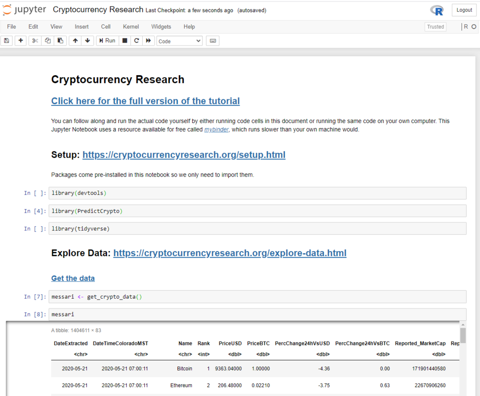
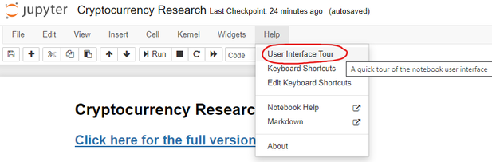
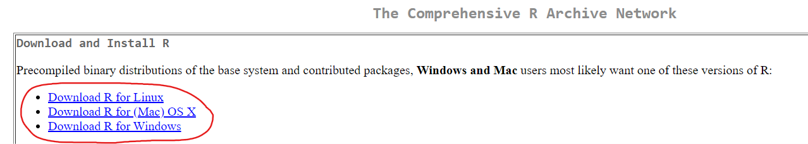
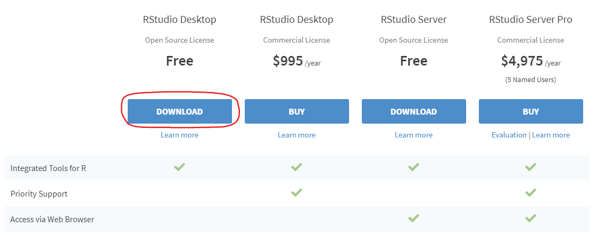

# Introduction {#introduction}

```{r initialSetup, message=FALSE, warning=FALSE, include=F}
library(bookdown)
library(knitr)
# tidy code
#knitr::opts_chunk$set(tidy = TRUE)
# to try to fix issue with ggplotly() not showing htmlwidget properly
knitr::opts_chunk$set(widgetframe_widgets_dir = 'widgets' )
# Get rid of messages and warnings
knitr::opts_chunk$set(warning = FALSE)#, message = FALSE)
# Try getting rid of extra unwanted outputs
knitr::opts_knit$set(progress=FALSE, verbose = FALSE)
# Source gs_key.R
#source("gs_key.R")
```

**(this book is a work in progress and is NOT ready)**

## What will I learn?

-   In this tutorial you will primarily learn about tools for the R programming language developed by [RStudio](https://rstudio.com/) and more specifically the [tidyverse](https://www.tidyverse.org/). If you are not familiar with these open source products, don't worry. We'll introduce these throughout the tutorial as needed.

-   The focus of the tutorial is on supervised machine learning, a process for building models that can predict future events, such as cryptocurrency prices. You will learn how to use the [`caret`](https://topepo.github.io/caret/index.html) package to make many different predictive models, and tools to evaluate their performance.

-   You will learn how to perform "group by" operations on your data using the [`dplyr`](https://dplyr.tidyverse.org/) package.

-   You will be exposed to some very useful data pre-processing R packages, including [`skimr`](https://github.com/ropensci/skimr), [`janitor`](https://garthtarr.github.io/meatR/janitor.html) and [`anytime`](http://dirk.eddelbuettel.com/code/anytime.html).

-   You will learn about some powerful [extensions to the ggplot2 visualization framework](https://exts.ggplot2.tidyverse.org/).

-   You will gain a better understanding of the steps involved in any supervised machine learning process, as well considerations you might need to keep in mind based on your specific data and the way you plan on acting on the predictions you have made. Each problem comes with a unique set of challenges, but there are steps that are necessary in creating any supervised machine learning model, and questions you should ask yourself regardless of the specific problem at hand.

<!-- For example, regardless of what you may be predicting, you need to make sure you are only using information that you would have readily available when it is time to make a new prediction.  -->

<!-- Note/Reminder, delete: Another example here would be keeping in mind the way you plan on actually using the predictions to take specific actions and how beneficial it is to maintain that perspective. -->

-   You will also learn a little about cryptocurrencies themselves, but **this is not a tutorial around blockchain itself or trading**.

## Before Getting Started

**There are two different versions of this tutorial, one high-level, accessible version and one detailed, code-heavy version. We recommend you start with the high-level version of the tutorial (\#1 below):**

1.  [The high-level version of this tutorial](https://cryptocurrencyresearch.org/high-level/) simplifies the supervised machine learning process as much as possible and provides a high-level framework that can be used for most supervised learning problems. When following along with this example, the results will be completely reproducible and the document is static and does not update over time. Even if your intent is to appropriate all the knowledge of the detailed tutorial, consider doing this tutorial first.

2.  The detailed tutorial is the document you are currently looking at, and is a full example showing one possible approach to making predictions on the cryptocurrency markets. Here we discuss the nuances that are specific to our data and problem. We focus on the supervised machine learning process and modeling many cryptocurrencies at once rather than real trades on these markets. This entire document and results are updated twice daily with the latest data.

## Who is this example for?

Are you a Bob, Hosung, or Jessica? This section provides more information on how to proceed with this tutorial.

-   **Bob (beginner)**: Bob is someone who understands the idea of predictive analytics at a high level and has heard of cryptocurrencies and is interested in learning more about both, but he has never used R. Bob would want to first [learn the basics of the R programming language](https://predictcrypto.org/r-basics-tutorial). Afterwards, like Hosung, he might decide to [opt for the more high-level version of this tutorial](https://cryptocurrencyresearch.org/high-level/).

    -   Bob might benefit from the book ["R for Data Science"](https://r4ds.had.co.nz/) and DataCamp's free ["Introduction to R"](https://www.datacamp.com/courses/free-introduction-to-r) course are great resources as well. Both are available for free online.

-   **Hosung (intermediate)**: Hosung is a statistician who learned to use R 10 years ago. He has heard of the tidyverse, but doesn't regularly use it in his work and he usually sticks to base R as his preference. Hosung should review the example explaining the pipe operator and the tidyverse [when it comes up in the next section](https://cryptocurrencyresearch.org/setup.html#tidy-example). Hosung does not care much for cryptocurrencies specifically, but is interested in learning new tools to use for his work in R and getting some useful boilerplate code. Hosung would want to start with the [**high-level version of this tutorial**](https://cryptocurrencyresearch.org/high-level/) and later return to the [**detailed tutorial**](https://cryptocurrencyresearch.org/index.html#introduction).

-   **Jessica (expert)**: Jessica is a business analyst who has experience with both R and the Tidyverse and uses the pipe operator (%\>%) regularly. Jessica should [**move onto the next section**](#introduction) for the detailed tutorial.

## Format Notes

-   You can hide the sidebar on the left by pressing the ***s*** key on your keyboard.

-   When the code is `highlighted this way`, that means we are referencing an R object of some kind. This will usually be an object in the R session like a dataset, but functions and packages are highlighted in the same way.

-   The cryptocurrency data was chosen to produce results that change over time and because these markets don't have any downtime (unlike the stock market).

## Plan of Attack

How will we generate predictive models to predict cryptocurrency prices? At a high level, here are the steps we will be taking:

1. [Setup guide](#setup). Installation guide on getting the tools used installed on your machine.

2. [Explore data](#explore-data). What ***is*** the data we are working with? How "good" is the "quality"? 

3. [Prepare the data](#data-prep). Make adjustments to "clean" the data based on the findings from the previous section to avoid running into problems when making models to make predictions.

4. [Visualize the data](#visualization). Visualizing the data can be an effective way to understand relationships, trends and outliers before creating predictive models.

5. [Make predictive models](#predictive-modeling). Now we are ready to take the data available to us and use it to make predictive models that can be used to make predictions about future price movements using the latest data.

6. [Evaluate the performance of the models](#evaluate-model-performance). Before we can use the predictive models to make predictions on the latest data, we need to understand how well we expect them to perform, which is also essential in detecting issues.


## Disclaimer

```{block2, note-disclaimer, type='rmdimportant'}
This tutorial is made available for learning and educational purposes only and the information to follow does not constitute trading advice in any way shape or form. We avoid giving any advice when it comes to trading strategies, as this is a very complex ecosystem that is out of the scope of this tutorial; we make no attempt in this regard, and if this, rather than data science, is your interest, your time would be better spent following a different tutorial that aims to answer those questions.
```

<!-- REMEMBER OTHER SPECIAL BLOCK TYPE IS CALLED "rmdcaution" USE THESE TO DRAW ATTENTION TO ANYTHING IMPORTANT! -->

<!--chapter:end:index.Rmd-->

# Setup and Installation {#setup}

<!-- (OLD COMMENTS, NOW DOING HITBTC FIRST AND MAKING THAT STEP REPRODUCIBLE AND EXPLAINING MESSARI DATA LATER) -->

<!-- Unfortunately, unlike the [high-level version](https://cryptocurrencyresearch.org/high-level/) we are not allowed to redistribute the data to others directly. Therefore, in order to use the same data used in this tutorial you will need to follow the instructions that we have outlined at this link: https://github.com/ries9112/messarir -->

<!-- Those instructions provide a guide on setting up a process to collect data using the Messari.io API and writing it to a Google Sheets dataset. After doing so every step outlined in the rest of this tutorial would work because it would be the exact same data. Because this is too much to ask out of the average user, we won't cover each step here, but they are linked in [the repository linked above](https://github.com/ries9112/messarir). If anything is unclear about the process and you are running into problems you can create an issue here: https://github.com/ries9112/messarir/issues -->

<!-- We recommend that most users follow along with this tutorial without setting up the data collection process and instead follow along with the document without running the code. -->

<!-- [NEED TO KEEP WORKING ON THIS. MESSARIR PACKAGE NEEDS PROPER INFRASTRUCTURE TO GET ANYONE DATA (BOTH FREE AND PRO API) COLLECTION PROCESS WRITING DATA INTO GOOGLE SHEETS AND HOW TO USE TO REPLICATE TUTORIAL] -->

<!-- NEED TO UPDATE THE ABOVE: Instead start with HitBTC data (provided through pins), and call out that won't be able to use Messari data without own data collection process. -->

You can follow the tutorial without coding. In that case, [**you can move on to the next page where the tutorial actually begins**](#overview).

## Option 1 - Run in the Cloud

If you do not currently have R and RStudio installed on your computer, you can run all of the code in a jupyter notebook using an R kernel that we have made available online in <a href="https://gesis.mybinder.org/binder/v2/gh/ries9112/Research-Paper-Example/0a23077a85848af214976c87d7d5d2472df700ee?filepath=Jupyter%2FCryptocurrency%20Research.ipynb" target="_blank">**this mobile friendly link**</a>.

This can take up to 30 seconds to load, and once it has you should see a page that looks like this:



**From here, you can run the code one cell at a time:**


*You can also use `Shift` + `Enter` to run an individual code cell*

**Or run all code cells at once (recommended):**


**If you feel lost, you can do a quick interactive walkthrough under *Help --\> User Interface Tour*:**



## Option 2 - Run Locally

If you want to follow along from your own computer directly (recommended option), please follow the installation instructions below. Afterwards, you will be able to run the code. You only need to follow these instructions **once**. If you have followed these steps once already, [**skip ahead to the next section**](#overview).

### Setup R

Hopefully you already have **R** and **RStudio** installed on your computer.

If you don't have these two programs installed, you will need to:

1.  [**Install R**](https://cran.revolutionanalytics.com/).



2.  [**Install RStudio**](https://rstudio.com/products/rstudio/download/). This step is optional, but it is very recommended that you use an integrated development environment [(IDE)](https://en.wikipedia.org/wiki/Integrated_development_environment) like RStudio as you follow along, rather than using the R console as it was installed in step 1 above.



## Installing and Loading Packages {#installing-and-loading-packages}

[ADD HERE] describe how to install packages, what they are, etc... like high-level version.

```{r install_pacman, eval=F}
install.packages('pacman')
```

Load pacman:

```{r load_pacman}
library(pacman)
```

Install other packages:

```{r install_all_other_packages}
p_load('pins','tidyverse','skimr','tsibble','doParallel','DT', 'caret','anytime','gganimate','tictoc','gifski',
       'xgboost','rayshader', 'rgl', 'ggthemes','ggTimeSeries',
       'av','magick')
```

Nice work! Now you have everything you need to [follow along with this example](#overview).

<!--chapter:end:01-Setup.Rmd-->

# Explore the Data {#explore-data}

## Pull the Data

The first thing we will need to do is download the latest data. We will do this by using the `pins` package [@R-pins], which has already been loaded into our session [in the previous section](#installing-and-loading-packages).

First, we will need to connect to a public GitHub repository (anyone can post their code to the GitHub website and make a "repository" with code for their project) and ***register*** the ***board*** that the data is ***pinned*** to by using the **`board_register()`** function:

```{r hitBTC-register}
board_register(name = "pins_board", url = "https://raw.githubusercontent.com/predictcrypto/pins/master/", board = "datatxt")
```

By running the `board_register()` command on the URL where the data is located, we can now ***"ask"*** for the data we are interested in, which is called `hitBTC_orderbook`:

```{r pull_data}
cryptodata <- pin_get(name = "hitBTC_orderbook")
```

The data has been saved to the `cryptodata` object.


## Data Preview {#data-preview}

```{r disable_scientific_notation, include=F}
options(scipen=999)
```

Below is a preview of the data:

```{r show_cryptodata, echo=F, message=FALSE, warning=FALSE}
library(DT)
datatable(head(cryptodata, 2000),  style = "default", 
          options = list(scrollX = TRUE, pageLength=3, lengthMenu = c(3, 5, 10)), rownames = F)
```

This is [***tidy data***](https://tidyr.tidyverse.org/articles/tidy-data.html), meaning:

1.  Every column is a variable.

2.  Every row is an observation.

3.  Every cell is a single value.

The data is collected once per hour and includes 120 days worth of data relative to today's date. Each row is an observation of an individual cryptocurrency, and the same cryptocurrency is tracked on an hourly basis, each time presented as a new row in the dataset.

<br>

Only the first 2,000 rows of the data are shown in the table above. There are `r nrow(cryptodata)` rows in the actual full dataset. The latest data is from `r max(cryptodata$date, na.rm =T )`.


## The definition of a "price"

[ADD HERE ABOUT ORDERBOOKS VS. PRICE SHOWN ON A WEBSITE]

The price of a cryptocurrency on an exchange is given by the [***order book***](https://www.investopedia.com/terms/o/order-book.asp), where traders can post trades they want to perform. [KEEP ADDING HERE]

<!-- A trade can be posted as a ***market*** order to purchase or sell the cryptocurrency at the currently most favori -->


## Data Quality {#data-quality}

First, let us get a general overview of the data to confirm there are no major data quality issues. There are several ways to do this, including using base R functions (base R meaning anything that comes with the default installation of R when you start up a new session), but we will use the `skimr`[@R-skimr] package to get a nicely formatted output.

We can use `skim()` on the `cryptodata` dataframe to get a summary of the data to help locate any potential problems:

```{r skimr}
skim(cryptodata)
```

<!-- ```{r show_data_preview, echo=F} -->

<!-- # try this post-call -->

<!-- knitr::kable(data_quality_overview, longtable = TRUE, booktabs = TRUE) -->

<!-- ``` -->

<!-- The new object we just created and displayed `data_quality_overview` contains a lot of useful information pertaining to the quality of the data. The column `complete_rate` for example, gives the percentage of non-missing values for each of the columns in the `cryptodata` data. While the output is slightly cut off on the right side of the document, you can see the full output by running the code on your computer. What is even neater about the object we made through `skimr`, is that the result itself is a dataframe that we can use to make adjustments to the data as needed. -->

<!-- We can see the result `data_quality_overview` that we displayed has columns of its own: -->

<!-- ```{r show_skimr_colnames} -->
<!-- colnames(data_quality_overview) -->
<!-- ``` -->

<!-- We can then use the information contained within this result to manipulate the data itself. For example we could exclude columns where 30% or more of the data is missing by applying the filter `complete_rate > 0.7` by using `subset()`: -->

<!-- ```{r remove_nulls_70_30_skimr} -->
<!-- subset(data_quality_overview, complete_rate > 0.7) -->
<!-- ``` -->


<!-- Think about how the resulting object would have less values for the column `skim_variable`, and how those values (meaning all columns with a complete rate greater than 70%) could then themselves be used to select which columns to remove out of the original dataset. We will use this idea in the [next section](#data-prep) to make the necessary adjustments to the data to dynamically get rid of any columns in the data that are missing too many values or don't have any variation in values. -->

<!-- Looking at this summary, you may have noticed the `Date` field is a character data type, so that's something else that we will need to convert in the [next section where we focus on the data preparation steps](#data-prep) before visualizing and modeling the data. -->

Move on to the [next section](#data-prep), where we make the adjustments necessary to the data before we can start making visualizations and predictive models.


<!--chapter:end:02-ExploreData.Rmd-->

# Data Prep {#data-prep}

[ADD HERE]

## Remove Nulls

[ADD HERE]

```{r omit_nulls}
cryptodata <- na.omit(cryptodata)
```

## Calculate `price_usd` Column

[ADD HERE]

Calculate the `price_usd` using the order books data and taking the cheapest price available from the **ask** side where at least \$15 worth of the cryptocurrency are being sold.

[ADD HERE]

```{r calc_price_usd}
cryptodata <- mutate(cryptodata, 
                     trade_usd_1 = ask_1_price * ask_1_quantity,
                     trade_usd_2 = ask_2_price * ask_2_quantity,
                     trade_usd_3 = ask_3_price * ask_3_quantity,
                     trade_usd_4 = ask_4_price * ask_4_quantity,
                     trade_usd_5 = ask_5_price * ask_5_quantity)
```

We can look at an example [ADD HERE]

```{r}
head(select(cryptodata, symbol, date_time_utc, ask_1_price, ask_1_quantity, trade_usd_1))
```

If none of the top 5 orders on the order book ask side are for at least \$15, exclude the row. [ADD HERE]

```{r calculate_price_usd}
cryptodata <- mutate(cryptodata, 
                     price_usd = case_when(
                       cryptodata$trade_usd_1 >= 15 ~ cryptodata$ask_1_price,
                       cryptodata$trade_usd_2 >= 15 ~ cryptodata$ask_2_price,
                       cryptodata$trade_usd_3 >= 15 ~ cryptodata$ask_3_price,
                       cryptodata$trade_usd_4 >= 15 ~ cryptodata$ask_4_price,
                       cryptodata$trade_usd_5 >= 15 ~ cryptodata$ask_5_price))
```

Now remove rows where we couldn't find a price above \$15 for any of the 5 cheapest orders in the order book.

```{r, include=F}
rowcount1 <- nrow(cryptodata)
```

```{r remove_null_price_usd}
cryptodata <- na.omit(cryptodata)
```

```{r, include=F}
rowcount2 <- nrow(cryptodata)
```

This step removed `r rowcount1-rowcount2` rows on the latest run.

## Any gaps?

[ADD HERE]

### Convert to tsibble

... the `tsibble` package [@R-tsibble]...

#### Convert to hourly data and get rid of minutes and seconds

... `anytime()` from the `anytime` package [@R-anytime]...

```{r}
cryptodata$ts_index <- anytime(paste0(cryptodata$pkDummy,':00:00')) 
```

... `as_tsibble()` from the `tsibble` package [@R-tsibble]...

```{r}
cryptodata <- as_tsibble(cryptodata, index=ts_index, key=symbol)
```

### Scan gaps

```{r}
scan_gaps(cryptodata)
```

### Fill gaps

```{r rowcount1, include=F}
rowcount1 <- nrow(cryptodata)
```

```{r fill_gaps}
cryptodata <- fill_gaps(cryptodata)
```

```{r rowcount2, include=F}
rowcount2 <- nrow(cryptodata)
```

Now looking at the data again, there are `r rowcount2-rowcount1` additional rows that were added as implicitly missing in the data:

```{r show_filled_cryptodata}
cryptodata
```

### Group Data

[ADD HERE]

```{r back_to_tibble}
cryptodata <- as_tibble(cryptodata)
```

[ADD HERE]

...`group_by()` from the `dplyr` [@R-dplyr] package...

```{r}
cryptodata <- group_by(cryptodata, symbol)
```

### Calculate Target

[ADD HERE]

Also adding lagged variables here! [ADD HERE]

...`mutate()` from the `dplyr` [@R-dplyr] package...

```{r}
cryptodata <- mutate(cryptodata, 
                     target_price_24h = lead(price_usd, 24, order_by=ts_index),
                     # Now all the lagged variables:
                     lagged_price_1h  = lag(price_usd, 1, order_by=ts_index),
                     lagged_price_2h  = lag(price_usd, 2, order_by=ts_index),
                     lagged_price_3h  = lag(price_usd, 3, order_by=ts_index),
                     lagged_price_6h  = lag(price_usd, 6, order_by=ts_index),
                     lagged_price_12h = lag(price_usd, 12, order_by=ts_index),
                     lagged_price_24h = lag(price_usd, 24, order_by=ts_index))
                     #lagged_price_3d  = lag(price_usd, 24*3, order_by=ts_index),
                     #lagged_price_7d  = lag(price_usd, 24*7, order_by=ts_index),
                     #lagged_price_14d = lag(price_usd, 24*14, order_by=ts_index),
                     #lagged_price_31d = lag(price_usd, 24*31, order_by=ts_index))
```

Here is an example showing the results for the subset of data related to the Ethereum cryptocurrency (symbol == 'ETH') showing 30 rows and the relevant columns we just calculated:

```{r}
print(select(filter(cryptodata, symbol == 'ETH'),date_time_utc, price_usd, lagged_price_1h, lagged_price_24h, target_price_24h), n=30)
```

The field `target_price_24h` should have the value of `price_usd` 24 hours into the future relative to the row of data. All the `lagged_` fields show the price from the past relative to `date_time_utc`.

## Remove subsets without enough rows

[ADD HERE]

```{r rm_subset_not_enough_rows}
cryptodata <- dplyr::filter(cryptodata, n() >= 700)
```

## Cross Validation

[ADD HERE]

(explain step below)

<!-- [TODO - Here will also need to explain that we are taking this process very step by step and focusing on doing this correctly, but in a tool used later on to make models (caret) this functionality is available without having to set this up, so don't worry about this being hard-coded to our specific needs.] -->

<!-- [TODO - ^ OR might be a good opportunity to explain how to write a function] -->

NEW CV METHOD - need to explain:

```{r ts_cross_validation}
# Remove rows with null date_time_utc to exclude missing data from next steps
cryptodata <- drop_na(cryptodata, date_time_utc)
# Counts by symbol
cryptodata <- cryptodata %>% group_by(symbol) %>% mutate(tot_rows = n())
# Add row index by symbol
cryptodata <- mutate(arrange(cryptodata, date_time_utc), row_id = seq_along(date_time_utc))
# Calculate what rows belong in the first split
cryptodata <- cryptodata %>% mutate(split_rows_1 = as.integer(n()/5),
                                    split_rows_2 = as.integer(split_rows_1*2),
                                    split_rows_3 = as.integer(split_rows_1*3),
                                    split_rows_4 = as.integer(split_rows_1*4),
                                    split_rows_5 = as.integer(split_rows_1*5))
# Now calculate what split the current row_id belongs into
cryptodata <- mutate(cryptodata, 
                     split = case_when(
                       row_id <= split_rows_1 ~ 1,
                       row_id <= split_rows_2 ~ 2,
                       row_id <= split_rows_3 ~ 3,
                       row_id <= split_rows_4 ~ 4,
                       row_id > split_rows_4 ~ 5))
# Now figure out train/test groups
cryptodata <- cryptodata %>% mutate(train_rows_1 = (as.integer(n()/5))*0.8,
                                    test_rows_1  = train_rows_1 + (as.integer(n()/5))*0.2,
                                    train_rows_2 = test_rows_1 + train_rows_1,
                                    test_rows_2  = train_rows_2 + (as.integer(n()/5))*0.2,
                                    train_rows_3 = test_rows_2 + train_rows_1,
                                    test_rows_3  = train_rows_3 + (as.integer(n()/5))*0.2,
                                    train_rows_4 = test_rows_3 + train_rows_1,
                                    test_rows_4  = train_rows_4 + (as.integer(n()/5))*0.2,
                                    train_rows_5 = test_rows_4 + train_rows_1,
                                    test_rows_5  = train_rows_5 + (as.integer(n()/5))*0.2)
# Now assign train/test groups
cryptodata <- mutate(cryptodata, 
                     training = case_when(
                       row_id <= train_rows_1 ~ 'train',
                       row_id <= test_rows_1 ~ 'test',
                       row_id <= train_rows_2 ~ 'train',
                       row_id <= test_rows_2 ~ 'test',
                       row_id <= train_rows_3 ~ 'train',
                       row_id <= test_rows_3 ~ 'test',
                       row_id <= train_rows_4 ~ 'train',
                       row_id <= test_rows_4 ~ 'test',
                       row_id <= train_rows_5 ~ 'train',
                       row_id > train_rows_5 ~ 'holdout'))
# Remove all columns that are no longer needed now
cryptodata <- select(cryptodata, -(tot_rows:test_rows_5), -(trade_usd_1:trade_usd_5),
                     -(ask_1_price:bid_5_quantity), -pair, -quote_currency, 
                     -pkDummy, -pkey, -ts_index, split)
```

Our data now has the new columns `training` (*train*, *test* or *holdout*) and `split` (numbers 1-5) added to it, let's take a look at the new columns:

```{r cross_validate_preview_1}
select(cryptodata, training, split, date)
```

*Notice that even though we left `symbol` variables out of our selection, because it is part of the way we grouped our data, it was added back in with the message "Adding missing grouping variables `symbol`". The data is tied to its groupings when performing all operations until we use `ungroup()` to undo them.*

Let's add the new `split` column to the way the data is grouped:

```{r}
cryptodata <- group_by(cryptodata, symbol, split)
```

The new field `split`, helps us split the data into 5 different datasets based on the date, and contains a number from 1-5. The new field `training` flags the data as being part of the ***train*** dataset, or the ***test*** (or ***holdout*** for the first split) dataset for each of the 5 splits/datasets.

Running the same code as before with `tail()` added, we should see rows associated with the test data of the 5th split (again remember, each of the 5 splits has a training and testing dataset):

```{r cross_validate_preview_tail}
tail( select(cryptodata, training, split, date) )
```

The easiest way to understand these groupings, is to visualize them. In the next section, you will learn powerful tools for visualizing data in R. Do not worry if you do not understand the code below and are not familiar with `ggplot()`, we will explain this framework in the [next section](#visualization), for now review the charts below and try to follow along with the way we are grouping the data for the predictive models by looking at what the x and y axis represent, as well as the colors. On the x-axis we are plotting the DateTime of when a data point was collected, and on the y-axis the `split` (1-5) as described in this section. The data is then colored based on the category assigned for the `training` variable ("train","test" or "holdout").

We can visualize the new grouping variables:

```{r cv_groupings_visualized}
groups_chart <- ggplot(cryptodata,
                       aes(x = date_time_utc, y = split, color = training)) +
                       geom_point() #+
                       #scale_y_reverse()
# now show the chart we just saved:
groups_chart
```

We can check on the groupings for each cryptocurrency by animating the previous chart:

```{r animate_groupings, message=FALSE, warning=FALSE}
library(gganimate)
animated_chart <- groups_chart +
    transition_states(symbol) +
    ggtitle('Now showing: {closest_state}')
# show the new animated chart
animate(animated_chart, fps = 2)
```

If/when need to slow these down, use this code: (can't change fps from 1 - or at least be careful, it's error prone) animate(animated\_chart, fps = 1)

***This is another tool that we will walk through in the [next section](#visualization).***

It can be a bit hard to tell how many data points there are because they end up looking like lines. Let's change the plot to use `geom_jitter()` instead of `geom_point()`, which will manually offset the points and let us see exactly how many data points there are:

```{r gganimate_jitter, message=FALSE, warning=FALSE}
animated_chart <- animated_chart +
                    geom_jitter()
# show the new animated chart
animate(animated_chart, fps = 2)
```


### Fix Data by Split

Now that we have split the data into many different subsets, those subsets themselves may have issues that prevent the predictive models from working as expected.

#### Zero Variance

One of the first models we will make is a simple linear model. The regular R function for this will not work if the data contains any columns that have "zero variance", meaning the value of the column never changes throughout the data being given to the model. Therefore, let's fix any issues relating to zero variance columns in any dataset before we change the structure of the data in the step after this one.

First let's create a new object called `find_zero_var` which shows the value of the minimum standard deviation across all columns and calculated based on the grouping of symbol, split and train. 

```{r}
find_zero_var <- select(mutate(cryptodata, min_sd = min(sd(price_usd, na.rm=T), 
                                                        sd(target_price_24h, na.rm=T),
                                                        sd(lagged_price_1h, na.rm=T), 
                                                        sd(lagged_price_2h, na.rm=T),
                                                        sd(lagged_price_3h, na.rm=T), 
                                                        sd(lagged_price_6h, na.rm=T),
                                                        sd(lagged_price_12h, na.rm=T), 
                                                        sd(lagged_price_24h, na.rm=T))), min_sd)
# Show data
find_zero_var
```

Now let's get to a list of cryptocurrency symbols where the minimum standard deviation across all columns for all splits of the data is 0.

```{r}
minimum_sd <- filter(distinct(mutate(group_by(ungroup(find_zero_var), symbol),
                                     min_sd = min(min_sd, na.rm=T)), min_sd),min_sd < 0.0001)$symbol
# Show result
minimum_sd
```

Now we can remove these symbols from appearing in the dataset:

```{r}
cryptodata <- filter(cryptodata, !(symbol %in% minimum_sd)) 
```

In the code above we match all rows where the symbol is part of the `minimum_sd` object with the list of cryptocurrency symbols to remove from the data, and we then negate the selection using the `!` operator to only keep rows with symbols not in the list we found.


<!-- Ugh wish I could write it like this: -->
<!-- ```{r} -->
<!-- find_zero_var %>% #start with data -->
<!--   ungroup() %>% #ungroup -->
<!--   group_by(symbol) %>% #re-group by symbol -->
<!--   mutate(min_sd = min(min_sd)) %>% #find the minimum by the symbol -->
<!--   select(min_sd) %>% #only keep symbol and min_sd -->
<!--   distinct() #distinct  -->
<!-- ``` -->


## Nest data

[ADD HERE]

... explain goal and method

... First make sure groupings are correct

<!-- [TODO - Reference Hadley's book chapter and video as references here] -->

```{r group_for_nest}
cryptodata <- group_by(cryptodata, symbol, split, training)
```

Example nesting data:

```{r make_nested_ex}
nest(cryptodata) 
```

First make training data nested:

```{r nest_train}
cryptodata_train <- rename(nest(filter(cryptodata, training=='train')), train_data = 'data')
# Now remove training column
cryptodata_train <- select(ungroup(cryptodata_train, training), -training)
# Fix issues with individual groups of the data
cryptodata_train$train_data <- lapply(cryptodata_train$train_data, na.omit)
# Remove elements with no rows after na.omit step. CONFIRM THIS WORKS!!!
# First add new column with nrow of train dataset
cryptodata_train <- group_by(ungroup(mutate(rowwise(cryptodata_train), train_rows = nrow(train_data))), symbol, split)
# Remove all symbols where their train data has less than 20 rows at least once
symbols_rm <- unique(filter(cryptodata_train, train_rows < 20)$symbol)
# Remove all data relating to the symbols found above
cryptodata_train <- filter(cryptodata_train, ! symbol %in% symbols_rm) # ! is to make %not in% operator
# Drop train_rows column
cryptodata_train <- select(cryptodata_train, -train_rows)
```

Now nest test data:

```{r nest_test}
cryptodata_test <- select(rename(nest(filter(cryptodata, training=='test')), test_data = 'data'), -training)
# Now remove training column
cryptodata_test <- select(ungroup(cryptodata_test, training), -training)
```

Also do holdout:

```{r nest_holdout}
cryptodata_holdout <- rename(nest(filter(cryptodata, training=='holdout')), holdout_data = 'data')
# Remove split and training columns from holdout
cryptodata_holdout <- select(ungroup(cryptodata_holdout, split, training), -split, -training)
```

Now join all nested data into the same dataframe

```{r}
# Join train and test
cryptodata_nested <- left_join(cryptodata_train, cryptodata_test,by = c("symbol", "split"))
# Join holdout
cryptodata_nested <- left_join(cryptodata_nested, cryptodata_holdout, by = c("symbol"))
```

New data:

```{r show_nested}
cryptodata_nested
```

[ADD HERE - Intro to Visualization and explain we will use grouped data in PredictiveModeling]

[ADD HERE - Worth mentioning the fact that some data will be higher quality, etc...? Give more background on those steps as "catch-alls"?]

## Functional Programming

Could work with the data using for loops, which is an "object-oriented" approach. Basically, we could take our given option, iterate through every row of the data, and perform operations on each row and subset of the data we are interested in. That is one approach, but instead we will use a different approach using a "functional programming" approach

<!-- https://youtu.be/rz3_FDVt9eg?t=1407  -->

<!-- [TODO - EXPLAIN THINGS A LOT MORE HERE] -->

<!-- ### Fix Data by Split -->

<!-- Now that we have split the data into many different subsets, those subsets themselves may have issues that prevent the predictive models from working as expected. -->

<!-- #### Zero Variance -->

<!-- One of the first models we will make is a simple linear model. The regular R function for this will not work if the data contains any columns that have "zero variance", meaning the value of the column never changes throughout the data being given to the model. Therefore, let's fix the zero variance issue programmatically for the train and test data of all datasets. -->

<!-- We will use the `skimr` package that we introduced in the [previous section](#explore-data) in order to find any columns where this problem is present, and we will then use that list to remove those columns from the data. -->

<!-- First, let's get the code to work the way it should on the first nested elements of the data as an example to apply to all other nested datasets. -->

<!-- We can find columns that have at least a 98% completion rate using a combination of `skim()` and `filter()`: -->

<!-- ```{r} -->
<!-- filter(skim(cryptodata_nested$train_data[[1]]), complete_rate > 0.02) -->
<!-- ``` -->

<!-- And extract the variable names by adding `$skim_variable` to the end of the result to return the results for that column only since that is what we are interested in. We will save the result in the object `example_variables` so we can use it in the next step. -->

<!-- ```{r} -->
<!-- example_variables <- filter(skim(cryptodata_nested$train_data[[1]]),  -->
<!--                             complete_rate > 0.02)$skim_variable -->
<!-- # Show the new object -->
<!-- example_variables -->
<!-- ``` -->

<!-- Now we can use that information to only keep these columns in the train data: -->
<!-- ```{r} -->
<!-- cryptodata_nested$train_data[[1]][, example_variables] -->
<!-- ``` -->


<!-- Great! Hopefully this change was not necessary on the first nested dataset. Now we need to apply the same idea to create a function that we can apply to all nested datasets -->

<!-- <!-- [TODO - Explain this step and process using map() better!] --> -->

<!-- ```{r} -->
<!-- remove_zero_var <- function(df){ -->
<!--   df[, filter(skim(df), complete_rate > 0.02)$skim_variable] -->
<!-- } -->
<!-- ``` -->


<!-- Now the function can be used in conjunction with the `map()` and `mutate()` functions to apply the function on each of the nested datasets and overwrite the old results with the new ones: -->
<!-- ```{r} -->
<!-- cryptodata_nested <- mutate(cryptodata_nested,  -->
<!--                             train_data = map(train_data, remove_zero_var)) -->
<!-- ``` -->

<!-- Now we need to do the same for the test data, but skipping over the empty  -->

<!-- [TODO - HERE AM I SKIPPING OVER EMPTY ONES OR KEEP TEST_AND_HOLDOUT AND TRAIN? SO NO NULL ROW ELEMENTS] -->

<!-- ```{r} -->
<!-- cryptodata_nested <- mutate(cryptodata_nested,  -->
<!--                             test_data = case_when(class(test_data)[[1]] == 'tbl_df' ~ map(test_data, remove_zero_var))) -->
<!-- ``` -->


<!--chapter:end:03-DataPrep.Rmd-->

# Visualization


<!-- NOTE 09/27: REVAMP THIS SECTION, ANSWER QUESTIONS ABOUT THE DATA MORE -->


<!-- NOTE 05/24: I'm thinking should calculate % change just for visualization purposes just here, but what if we avoid that completely and instead make the tutorial on visualizing price over time for BTC first and then creating gganimate tutorial to iterate over the rest? Just keep it to ggplot2 + extensions + gganimate tutorial here, no need to make a million visualizations. Would be good to add rayshader too, but add that as a stretch goal for later. -->

Making visualizations using `ggplot2` is one of the very best tools available in the R ecosystem. The ***gg*** in `ggplot2` stands for the ***Grammar of Graphics***, which is essentially the idea that many different types of charts share the same underlying building blocks, and that they can be put together in different ways to make charts that look very different from each other. [In Hadley's own words,](https://qz.com/1007328/all-hail-ggplot2-the-code-powering-all-those-excellent-charts-is-10-years-old/) "a pie chart is just a bar chart drawn in polar coordinates", "They look very different, but in terms of the grammar they have a lot of underlying similarities."


## Basics - ggplot2

So how does `ggplot2` actually work? ***"...in most cases you start with `ggplot()`, supply a dataset and aesthetic mapping (with `aes()`). You then add on layers (like `geom_point()` or `geom_histogram()`), scales (like `scale_colour_brewer()`), faceting specifications (like `facet_wrap()`) and coordinate systems (like `coord_flip()`)."*** - [ggplot2.tidyverse.org/](https://ggplot2.tidyverse.org/).

Let's break this down step by step.

***"start with ggplot(), supply a dataset and aesthetic mapping (with aes())***


```{r ggplot_blank}
ggplot(data = cryptodata, aes(x = date_time_utc, y = price_usd))
```


The chart now shows up but is blank because we need to perform an additional step ***"You then add on layers (like `geom_point()` or `geom_histogram()`)..."***

We can take the exact same code as above and add ***+ `geom_point()`***

```{r ggplot_geom_point}
ggplot(data = cryptodata, aes(x = date_time_utc, y = price_usd)) +
       # adding geom_point():
       geom_point()
```

The most expensive cryptocurrency being shown, `r subset(cryptodata, price_usd == max(cryptodata$price_usd))$symbol` in this case, makes it difficult to take a look at any of the other ones. Let's try *zooming-in* on a single one by using the same code but making an adjustment to the `data` parameter to only show data for the cryptocurrency with the symbol *ETH*, first let's filter the data down to those results only:
```{r ETH_subset}
eth_data <- subset(cryptodata, symbol == 'ETH')
```

```{r ggplot_ETH}
ggplot(data = eth_data, 
       aes(x = date_time_utc, y = price_usd)) + 
       geom_point()
```

*The axis automatically adjusted to the new data.*

This is better, but geom_point() might not be the best choice for this chart, let's change `geom_point` with `geom_line` and see what that looks like:

```{r ggplot_ETH_line}
ggplot(data = eth_data, 
       aes(x = date_time_utc, y = price_usd)) + 
       # changing geom_point() into geom_line():
       geom_line()
```

Let's save the results as an object called `crypto_chart`:
```{r}
crypto_chart <- ggplot(data = eth_data, 
                       aes(x = date_time_utc, y = price_usd)) + 
                       geom_line()
```


We can add a linear regression line going through the plot to show the strength of the relationship between the two values. A horizontal line would show a weak relationship, while a sloped line would show a strong one.

```{r ggplot_ETH_lm_relationship}
crypto_chart <- crypto_chart + stat_smooth(method = 'lm')
crypto_chart
```

Next, let's adjust the labels on the chart:
```{r ggplot_labels}
crypto_chart <- crypto_chart +
                  ggtitle('Previous 24h % Price Change Vs. Next 24h Price % Change', 
                          subtitle = max(eth_data$symbol)) + 
                  xlab('Previous 24 hours % Price Change') +
                  ylab('Next 24 hours % Price Change')
# display the new chart
crypto_chart
```


## Using Extensions

### ggthemes
Let's import a `ggplot2` ***"extension"*** by importing a package called `ggthemes` [@R-ggthemes] and apply a theme to change the overall look of the chart:

```{r ggthemes, message=FALSE, warning=FALSE}
# apply the theme "economist"
crypto_chart <- crypto_chart + theme_economist()
# display the new chart
crypto_chart
```

*You can find a full list of themes here: https://yutannihilation.github.io/allYourFigureAreBelongToUs/ggthemes/*


### plotly
In some cases, it's helpful to make a chart responsive to a cursor hovering over it. We can convert any ggplot into an interactive chart by using the `plotly` [@R-plotly] package:

<!-- CAUSES ISSUES 06/11 -->
<!-- ```{r plotly, message=FALSE, warning=FALSE} -->
<!-- library(plotly) -->
<!-- # wrap any ggplot in the function ggplotly() to make it interactive -->
<!-- ggplotly(crypto_chart) -->
<!-- # notice that we did not overwrite the crypto_chart object this time -->
<!-- ``` -->

If you are not looking to convert a ggplot, plotly also provides its own framework for making charts available in R, you can find out more about it here: https://plotly.com/r/

<!-- ```{r show_plotly_website, echo=F} -->
<!-- knitr::include_url("https://plotly.com/r/", -->
<!--   height = "600px") -->
<!-- ``` -->
<!-- ***https://plotly.com/r/*** -->

<!-- NOT WORKING ANYMORE ON 10/21/2020: -->
<!-- ### ggpubr -->
<!-- We can use another extension called `ggpubr` [@R-ggpubr] and show the regression formula itself as well as correlation metrics (R-squared and p-value) on the chart. -->

<!-- ```{r ggpubr, message=FALSE, warning=FALSE} -->
<!-- library(ggpubr) -->
<!-- # use the custom imported functions stat_cor() and stat_regline_equation() -->
<!-- crypto_chart <- crypto_chart + -->
<!--                   stat_cor(label.x = -30, label.y = 25) + -->
<!--                   stat_regline_equation(label.x = -30, label.y = 20) + -->
<!--                   xlim(c(-35,35)) + ylim(c(-35,35)) -->
<!-- # display the new chart -->
<!-- crypto_chart -->
<!-- ``` -->

<!-- ### ggforce (NOT WORKING! ERROR, NOT SURE WHAT CHANGED) -->

<!-- The `ggforce` package [@R-ggforce] is a useful tool for annotating charts. We can annotate outliers for example: -->

<!-- ```{r add_ggforce_annotations} -->
<!-- library(ggforce) -->

<!-- crypto_chart <- crypto_chart +  -->
<!--                   geom_mark_ellipse(aes(filter = volume_last_24_hours == max(volume_last_24_hours), -->
<!--                                         label = date_extracted , -->
<!--                                         description=paste0('Price spike to $',price_usd))) + -->
<!--                   geom_mark_ellipse(aes(filter = volume_last_24_hours == min(volume_last_24_hours), -->
<!--                                         label = date_extracted , -->
<!--                                         description=paste0('Price drop to $',price_usd)))  -->
<!-- ``` -->

<!-- ```{r} -->
<!-- crypto_chart -->
<!-- ``` -->

### gganimate


<!-- LOOK THROUGH THIS AND PUT THE PRICE OVER TIME CHART AND THE RELATIONSHIP BETWEEN PREVIOUS PRICE AND NEXT 24H PRICE SIDE BY SIDE, AND HAVE THEM ANIMATED ITERATING OVER ALL CRYPTOCURRENCIES: https://github.com/thomasp85/gganimate/wiki/Animation-Composition -->

<!-- DISABLED CODE BELOW BECAUSE OF AN ERROR "trasnformr is required to tween paths and lines" -->

We can repeat the same steps on the complete dataset, and then animate the results for each of the groups. Here is the first chart again, animated based on the groupings we created in the previous section:
```{r first_gganimate, message=FALSE, warning=FALSE}
animated_prices <- ggplot(data = mutate(cryptodata, groups=symbol),
                          aes(x = date_time_utc, y = price_usd)) +
                          geom_point() +
                          transition_states(groups) +
                          ggtitle('Price Over Time',subtitle = '{closest_state}') +
                          view_follow() # this adjusts the axis based on the group
# Show animation:
animated_prices
```

We can slow down the animation by using `animate()` and choosing the speed in terms of the frames per second (`fps`)"
```{r gganimate_speed, message=FALSE, warning=FALSE}
animated_prices_result <- animate(animated_prices,fps=1)
# show slowed down results
animated_prices_result
```

<!-- More animate options: -->
<!-- animate( -->
<!--     plot = my_plot, -->
<!--     render = gifski_renderer(), -->
<!--     height = 600, -->
<!--     width = 800,  -->
<!--     duration = 5, -->
<!--     fps = 20) -->


<!-- COMMENTED OUT BECAUSE WAS USING PRICE INSTEAD OF % CHANGE -->
<!-- ### gghiglight -->

<!-- Instead of iterating over each cryptocurrency one at a time like we did with the animation above, we might want to get a better side-by-side view of all our groups. -->

<!-- The `gghighlight` [@R-gghighlight] package lets us plot all groups on the same chart, and highlight the series we are interested in. -->

<!-- For example, we can plot the percentage change in price over a 24 hour period for all cryptocurrencies, and highlight those we are interested in to compare them against the rest of the trends. -->
<!-- ```{r gghighlight_percent_change, message=FALSE, warning=FALSE} -->
<!-- library(gghighlight) -->
<!-- ggplot(cryptodata, -->
<!--        aes(x=date_time_utc, y=((sell_price_usd_24h_later - price_usd)/price_usd) * 100, colour=symbol)) + -->
<!--   geom_line() + -->
<!--   ylab('Next 24 hours % Price Change') + -->
<!--   gghighlight(symbol=='Bitcoin') -->
<!-- ``` -->


Awesome! Move on to the [next section](#predictive-modeling) to start making predictive models for the data, or keep reading below to learn more about ggplot2 extensions.


<!-- ### ggmap -->

<!-- (could probably get rid of this, cool but not super relevant) -->


<!-- There are so many different extensions for ggplot that it feels like a disservice to not be able to cover them all, so in order to show just how creative you can get, here is one last example using the `ggmap` [@R-ggmap] package. -->

<!-- ```{r import_ggmap, message=FALSE, warning=FALSE} -->
<!-- library(ggmap) -->
<!-- ``` -->

<!-- ```{r google_key, include=F} -->
<!-- register_google(gs_key) -->
<!-- ``` -->

<!-- Let's create a ggplot with the latest Google Maps satellite image of one of the towns in Russia where cryptocurrency mining facilities are prevalent. It is not easy to keep a massive facility with many powerful computers cool, so naturally very cold places like this are ideal to help keep electricity costs down. -->

<!-- ```{r show_google_map} -->
<!-- ggmap(get_map('Bratsk Russia', zoom=15, maptype='hybrid')) -->
<!-- ``` -->

<!-- We can take a slightly different view of the same location: -->

<!-- ```{r show_google_map_zoomed} -->
<!-- ggmap(get_map('Bratsk Russia', zoom=13, maptype='satellite')) -->
<!-- ``` -->

<!-- Or we could enter coordinates for a location directly instead of doing a search, here is Area 51 in Nevada for example:
<!-- ```{r}
<!-- ggmap(get_map(c(lon=-115.81, lat=37.2431), zoom=15, maptype='satellite'))
<!-- ```

If you wanted to use `ggmaps`, unfortunately this tool will require you to create your own API key through Google and connect it using `register_google()` and passing the API key to the function, before you can start returning maps. [Click here to find out more about ggmaps and getting it setup on your device, which is straightforward](https://github.com/dkahle/ggmap).

<!-- IMPORTANT: THE TUTORIAL IN THIS SECTION SHOULD MAINLY CONSIST OF GGPLOT FUNCTIONALITY, INTRODUCING EXTENSIONS, ANNOTATING CHARTS WITH GGFORCE, CREATING ANIMATIONS WITH GGANIMATE, PUTTING MULTIPLE ONES TOGETHER USING PATCHWORK.
<!-- ALSO FOCUS ON HOW DO YOU PLOT GROUPS OF DATA AS WELL AS TIMESERIES DATA, WORTH MENTIONING GGHIGHLIGHT AS WELL AS USING REGULAR FACETS, OR PLUGGING DATA INTO TRELLISCOPE.


<!-- ### Other ways to explore grouped data -->

<!-- Instead of iterating over each cryptocurrency one at a time like we did with the animation above, we might want to get a better side-by-side view of all our groups.  -->

<!-- #### gghiglight -->

<!-- The `gghighlight` [@R-gghighlight] package lets us plot all groups on the same chart, and highlight the series we are interested in.  -->

<!-- For example, we can plot the percentage change in price over a 24 hour period for all cryptocurrencies, and highlight those we are interested in to compare them against the rest of the trends. -->
<!-- ```{r gghighlight_percent_change, message=FALSE, warning=FALSE} -->
<!-- library(gghighlight) -->
<!-- ggplot(cryptodata,  -->
<!--        aes(x=date_time_utc, y=((sell_price_usd_24h_later - price_usd)/price_usd) * 100, colour=symbol)) + -->
<!--   geom_line() + -->
<!--   ylab('Next 24 hours % Price Change') + -->
<!--   gghighlight(symbol=='Bitcoin') -->
<!-- ``` -->


<!-- <!-- Rayshader here? -->


<!-- <!-- END HERE, ADD REST OF SECTIONS ABOVE: -->

<!-- ### More Extensions -->

<!-- We only scratched the surface of what is possible, and new tools are frequently developed by the community.  -->

<!-- ***You can explore the large number of ggplot2 extensions here:*** -->
<!-- ```{r show_ggplot_extensions_website, echo=F} -->
<!-- knitr::include_url("https://exts.ggplot2.tidyverse.org/gallery/", -->
<!--   height = "600px") -->
<!-- ``` -->

<!-- ***You could even write your own extensions:*** -->
<!-- ```{r show_ggplot_extensions_make_your_own, echo=F} -->
<!-- knitr::include_url("https://ggplot2-book.org/extensions.html", -->
<!--   height = "600px") -->
<!-- ``` -->


<!-- NEW CODE BELOW, DON'T DELETE: -->


<!-- For this section, let's use the object `cryptodata` instead of `crypto_grouped`, which is what will be used in the [next section for the predictive modeling](#predictive-modeling). The non-grouped object will be easier to work with for the visualizations. -->

<!-- The first thing we can do, is visualize the target % change over time for our data across the different cryptocurrencies. We will use the `ggplot2` package, which is part of the `tidyverse` package that we already imported into the R session earlier, so we don't need to import `ggplot2` to use its functions. -->

<!-- Using `ggplot()`, we can build a chart by first specifying `ggplot(data, aes(x = [variable1], y = [variable2]))`, and then using the correct ***geom*** to decide how to plot the information. We can take the ggplot we just made and add `geom_line()` to show the target variable we calculated in [the previous section](#add-target) over time: -->

<!-- ```{r first_visualization} -->
<!-- ggplot(cryptodata, aes(x=date_time_utc, y=target_percent_change)) + -->
<!--   geom_line() -->
<!-- ``` -->

<!-- This chart however is not exactly useful. Which cryptocurrency is which? There are so many lines that they show up as big black blobs instead, which is not what we want. We can take the same chart, and within the `aes()` argument of `ggplot()` we can simply add the argument `colour=symbol` to add different colors to identify each cryptocurrency: -->

<!-- ```{r first_visualization_by_symbol} -->
<!-- ggplot(cryptodata, aes(x=date_time_utc, y=target_percent_change, colour=symbol)) + -->
<!--   geom_line() -->
<!-- ``` -->

<!-- This is even less useful than before because there are too many different cryptocurrencies. We can use the `gghighlight` package in order to just highlight the top 10 cryptocurrencies by rank instead. When working with ggplots, the whole idea is to build the chart piece by piece, and we will do something similar by simply adding `+ gghighlight([condition])` to the same exact code we just ran above: -->

<!-- ```{r first_visualization_by_symbol_gghighlight} -->
<!-- library(gghighlight) # not part of the tidyverse so needs to be loaded -->
<!-- ggplot(cryptodata, aes(x=date_time_utc, y=target_percent_change, colour=symbol)) + -->
<!--   geom_line() + -->
<!--   gghighlight(rank <= 5) -->
<!-- ``` -->

<!-- Now let's zoom in on things a bit: -->

<!-- ```{r first_visualization_by_symbol_gghighlight_zoom} -->
<!-- library(gghighlight) # not part of the tidyverse so needs to be loaded -->
<!-- ggplot(cryptodata, aes(x=date_time_utc, y=target_percent_change, colour=symbol)) + -->
<!--   geom_line() + -->
<!--   gghighlight(rank <= 5) + -->
<!--   scale_x_datetime(limits = c(Sys.time() - 10*60*60*10, Sys.time()-80000)) + -->
<!--   scale_y_continuous(limits = c(-10,10)) -->
<!-- ``` -->

<!-- Are these trends connected in any way? We can use the package `plotly`[@R-plotly] to wrap the same chart in the function `ggplotly` to make this chart interactive and get more information out of it. Click and drag to move the plot around and scroll within the chart to zoom in and out. -->
<!-- ```{r first_visualization_ggplotly} -->
<!-- library(plotly) -->
<!-- (ggplot(cryptodata, aes(x=date_time_utc, y=target_percent_change, colour=symbol)) + -->
<!--   geom_line() + -->
<!--   gghighlight(rank <= 5) + -->
<!--   scale_x_datetime(limits = c(Sys.time() - 10*60*60*10, Sys.time()-80000)) + -->
<!--   scale_y_continuous(limits = c(-10,10))) %>%  -->
<!--   ggplotly() -->
<!-- ``` -->


<!-- ## Rayshader -->

<!-- We can use the `Rayshader` package to create a 3d representation of a ggplot. We can first make a heatmap of the 24 hour target % change over time and assign it to the object `rayshader_plot`: -->

<!-- ```{r first_visualization_hex} -->
<!-- rayshader_plot <- ggplot(cryptodata, aes(x=date_time_utc, y=target_percent_change)) + geom_hex() -->
<!-- ``` -->

<!-- We can then wrap the result in `plot_gg()`: -->

<!-- ```{r first_rayshader} -->
<!-- library(rayshader) -->
<!-- plot_gg(rayshader_plot) -->
<!-- rgl::rglwidget() -->
<!-- ``` -->


<!-- NEW NOTES MAY -->

<!-- - Here could give more details around flipside FCAS ratings and compare groups to % target, could do it by cv_fold and gganimate -->

<!-- - gghighlight % change over time all cryptos, highlighting top 5 -->


<!-- REMEMBER TO LEVERAGE GGANIMATE AND RAYSHADER FOR THIS SECTION -->


<!-- OLD CODE BELOW -->


<!-- **Summary for discussion:** Having narrowed down the dataset to less but more interesting variables, we should be able to create some relatively interesting visualizations here. Doing so, relationships like the previous 24h % change to the target variable, become *extremely* obvious.  -->

<!-- We will introduce the idea that as a cryptocurrency trader there are limitations based on where you live, and whether the cryptocurrency is large enough to actually be found on an exchange that you can trade on. For example, Binance was by far the largest exchange in the US, but it became illegal for US citizens to trade on Binance in 2019, and people in the United States can now only trade on "Binance US", which offers a smaller selection of cryptocurrencies to trade on. **So,** the observed relationships that seem extremely strong when looking at the market as a whole are actually not nearly as strong when you look at an individual exchange that people in the US could actually trade on. -->

<!-- Therefore the section will end with the same visual exploration from the start of the section, but breaking things down by 4 exchanges, and calculating the % change in the prices using the prices found on those specific exchanges directly instead of the aggregated average reported price. These relationships will be much weaker than the illusion created by looking at the markets as a whole. The 4 exchanges would be KuCoin, HitBTC, BitMart and Bibox; these ones specifically, because I have web scrapers that collect the prices specific to these exchanges only. I could set more up, I just have these ones because I identified these as the best exchanges for me to do trades on using an automated strategy in terms of them working with the tools I am using and having a large variety of cryptocurrencies. -->

<!-- A good approach might be to explore 1 exchange only, and offer additional material around doing the same for the other 3 that people can use as they will. -->


<!-- Here just add just one example for now of one chart going over ggplot2 syntax and general idea (look at what I wrote for tutorials), add a theme to it, turn it into an interactive plot, then use rayshader on it (so probably best to do a hex which looks nice) -->


<!-- ```{r setupVisualization, echo=F, message=FALSE, warning=FALSE} -->
<!-- # setup here -->
<!-- # library(plotly) -->
<!-- # library(ggpubr) -->
<!-- # library(rayshader) -->
<!-- # library(gghighlight) -->
<!-- ``` -->


<!-- Let's take a first look at the data by looking at the price of different cryptocurrencies over time: -->

<!-- ```{r message=FALSE, warning=FALSE} -->
<!-- # library(gghighlight) -->
<!-- # ggplot(cryptodata, aes(x=date, y=price_usd, colour=symbol)) + -->
<!-- #   geom_line() + -->
<!-- #   gghighlight(symbol=='BTC'|symbol=='ETH') -->
<!-- ``` -->

<!-- Bitcoin (BTC) and Bitcoin (ETH) are highlighted using the `gghighlight` [@R-gghighlight] package. -->

<!-- <!-- ***Note for discussion: create custom plotting function or walk through ggplot code?*** --> 

<!-- It's hard to tell anything about the data from the previous view because of the differences in the range in prices ($). Let's take the log of the price and make the same chart: -->

<!-- <!-- ```{r message=FALSE, warning=FALSE} -->
<!-- <!-- ggplot(cryptodata, aes(x=date, y=log(price_usd), colour=symbol)) + --> 
<!-- <!--   geom_line() + -->
<!-- <!--   gghighlight(symbol=='BTC'|symbol=='ETH'|symbol=='MANA') --> 
<!-- <!-- ``` -->


<!-- CREATE CUSTOM FUNCTION TO CREATE THIS PLOT PLOT_price_usd(log_price=TRUE) - OR BETTER TO LEAVE AS IS? -->


<!-- ```{r visualize_target_percent_change, warning=FALSE} -->
<!-- ggplot(cryptodata, aes(x=date, y=target_percent_change, colour=symbol)) + -->
<!--   geom_point() + -->
<!--   ylim(c(-20,20))  + -->
<!--   geom_smooth(method = "loess", colour='blue') + -->
<!--   gghighlight(symbol=='ETH') -->
<!-- ``` -->


<!-- Rayshader example: -->
<!-- ```{r} -->
<!-- plot_gg(ggplot(subset(cryptodata,symbol=='BTC'), aes(x=date, y=fees_daily_mean_usd, colour=fees_daily_median_usd)) + -->
<!--   geom_point() ) -->
<!-- ``` -->


<!-- REMEMBER TO LEVERAGE GGANIMATE AND RAYSHADER FOR THIS SECTION -->


<!-- OLD V2 BELOW: -->


<!-- ### Calendar heatmap -->

<!-- ```{r} -->
<!-- # From https://towardsdatascience.com/time-series-calendar-heatmaps-9f576578fcfe -->
<!-- library(plyr) -->
<!-- library(plotly) -->
<!-- library(tidyquant) -->
<!-- poloniex_btc_calendar <- poloniex_btc -->
<!-- poloniex_btc_calendar$weekday = as.POSIXlt(poloniex_btc_calendar$date)$wday +1 #finding the day no. of the week -->
<!-- poloniex_btc_calendar$weekdayf<-factor(poloniex_btc_calendar$weekday,levels=rev(1:7),labels=rev(c("Mon","Tue","Wed","Thu","Fri","Sat","Sun")),ordered=TRUE) #converting the day no. to factor -->
<!-- poloniex_btc_calendar$monthf<-factor(month(poloniex_btc_calendar$date),levels=as.character(1:12),labels=c("Jan","Feb","Mar","Apr","May","Jun","Jul","Aug","Sep","Oct","Nov","Dec"),ordered=TRUE) # finding the month -->
<!-- poloniex_btc_calendar$yearmonth<- factor(as.yearmon(poloniex_btc_calendar$date)) #finding the year and the month from the date. Eg: Nov 2018 -->
<!-- poloniex_btc_calendar$week <- as.numeric(format(poloniex_btc_calendar$date,"%W")) #finding the week of the year for each date -->
<!-- poloniex_btc_calendar<-ddply(poloniex_btc_calendar,.(yearmonth),transform,monthweek=1+week-min(week)) #normalizing the week to start at 1 for every month -->

<!-- poloniex_btc_calendar$year <- substr(poloniex_btc_calendar$date,1,4) -->
<!-- poloniex_btc_calendar <- filter(poloniex_btc_calendar, year > 2016) -->

<!-- price_heatmap <- ggplot(poloniex_btc_calendar, aes(monthweek, weekdayf, fill = poloniex_btc_calendar$price_usd)) + geom_tile(colour = "white") + facet_grid(year(poloniex_btc_calendar$date)~monthf) + scale_fill_gradient(low="red", high="green") + xlab("Week of Month") + ylab("") + ggtitle("Time-Series Calendar Heatmap: BTC Price ($)") + labs(fill = "Price") -->


<!-- #price_heatmap -->
<!-- plot_gg(price_heatmap) -->
<!-- ``` -->


<!-- Does the previous 24h % change affect the outcome of the % change for the next 24 hours? -->

<!-- ```{r targetVsChange, warning=F} -->
<!-- # adjust this to be a heatmap/different look instead -->
<!-- ggplot(poloniex_btc, aes(x=change_percent, y=target_perc_change)) + -->
<!--   geom_point(color='deepskyblue4', size=1.5) + -->
<!--   xlim(c(-20,20)) + -->
<!--   ylim(c(-20,20)) + -->
<!--   stat_cor(label.x = -20, label.y = 20) + -->
<!--   stat_regline_equation(label.x = -20, label.y = 17) + -->
<!--   labs(title='Relationship between previous 24h % change and next 24h % change vs. USD', -->
<!--        x='Previous 24h % Change', y= 'Next 24h % Change (Target)') + -->
<!--   geom_smooth(color = 'lightcoral', method = 'lm') -->
<!-- ``` -->


<!-- Same chart but filtered down to Bitcoin only: -->

<!-- ```{r targetVsChangeBTC, warning=F} -->
<!-- # adjust this to be a heatmap/different look instead -->
<!-- ggplot(filter(investing_dot_com,symbol=='BTC'), aes(x=change_percent, y=target_perc_change)) + -->
<!--   geom_point(color='deepskyblue4', size=1.5) + -->
<!--   xlim(c(-20,20)) + -->
<!--   ylim(c(-20,20)) + -->
<!--   stat_cor(label.x = -20, label.y = 20) + -->
<!--   stat_regline_equation(label.x = -20, label.y = 17) + -->
<!--   labs(title='Relationship between previous 24h % change and next 24h % change vs. USD', -->
<!--        x='Previous 24h % Change', y= 'Next 24h % Change (Target)') + -->
<!--   geom_smooth(color = 'lightcoral', method = 'lm') -->
<!-- ``` -->


<!-- Same chart but filtered down to Bitcoin only: -->

<!-- ```{r targetVsChangeETH, warning=F} -->
<!-- # adjust this to be a heatmap/different look instead -->
<!-- ggplot(filter(investing_dot_com,symbol=='ETH'), aes(x=change_percent, y=target_perc_change)) + -->
<!--   geom_point(color='deepskyblue4', size=1.5) + -->
<!--   xlim(c(-20,20)) + -->
<!--   ylim(c(-20,20)) + -->
<!--   stat_cor(label.x = -20, label.y = 20) + -->
<!--   stat_regline_equation(label.x = -20, label.y = 17) + -->
<!--   labs(title='Relationship between previous 24h % change and next 24h % change vs. USD', -->
<!--        x='Previous 24h % Change', y= 'Next 24h % Change (Target)') + -->
<!--   geom_smooth(color = 'lightcoral', method = 'lm') -->
<!-- ``` -->


<!-- ## Percent Change in Price Vs. USD Over Time -->

<!-- First convert the data to a `tsibble` which is a specialized data type that makes working with timeseries data more effective -->

<!-- ```{r paged.print=TRUE} -->
<!-- library(tsibble) -->
<!-- coin_metrics$date <- as.Date(coin_metrics$date_time_utc) -->
<!-- coin_metrics_tsbl <- as_tsibble(coin_metrics, key = symbol, index = date) -->
<!-- datatable(head(coin_metrics_tsbl,1000)) -->
<!-- ``` -->

<!-- Same deal with the other table: -->
<!-- ```{r} -->
<!-- coin_metrics$date <- as.Date(coin_metrics$date_time_utc) -->
<!-- coin_metrics_tsbl <- as_tsibble(coin_metrics, key = symbol, index = date) -->
<!-- datatable(head(coin_metrics_tsbl,1000)) -->
<!-- ``` -->


<!-- ## Find outliers -->

<!-- ```{r} -->
<!-- library(brolgar) -->
<!-- min_max <- poloniex_btc %>% -->
<!--   ungroup() %>% -->
<!--   filter(near_quantile(target_perc_change, c(0,1), 0.01)) -->
<!-- gg_id_features_red_dots <- -->
<!--   ggplot(poloniex_btc, -->
<!--          aes(x = date_time_utc, -->
<!--              y = target_perc_change)) + -->
<!--   geom_point(data = min_max, -->
<!--              colour = "#c03018", -->
<!--              size = 6) + -->
<!--   geom_point() -->
<!-- gg_id_features_red_dots -->
<!-- ``` -->


<!-- ```{r} -->
<!-- gg_id_features_red_dots_only <- -->
<!-- ggplot(min_max, -->
<!--        aes(x = date_time_utc, -->
<!--            y = target_perc_change, -->
<!--            group = symbol)) + -->
<!--   geom_point(colour = "#c03018", -->
<!--              size = 6) + -->
<!--   geom_point() -->
<!-- gg_id_features_red_dots_only -->
<!-- ``` -->


<!-- ```{r} -->
<!-- library(ggrepel) -->
<!-- gg_id_features_red_dots_only + -->
<!--   geom_label_repel(colour = "#c03018", -->
<!--              aes(label = as.character(date)), -->
<!--              size = 5, -->
<!--              nudge_x = -10) -->
<!-- ``` -->


<!-- ## Correlations -->


<!-- Select numeric variables: -->

<!-- ```{r} -->
<!-- poloniex_btc_correlations <- dplyr::select_if(poloniex_btc, is.numeric) -->
<!-- ``` -->

<!-- Calculate correlation: -->

<!-- ```{r} -->
<!-- poloniex_btc_correlations <- cor(poloniex_btc_correlations, use="complete.obs") -->
<!-- #btc_correlations <- as.data.frame(btc_correlations) -->
<!-- #btc_correlations %>% select(target_perc_change) %>% round(2) -->
<!-- ``` -->

<!-- ```{r} -->
<!-- library(ggcorrplot) -->
<!-- ggcorrplot(poloniex_btc_correlations) -->
<!-- ``` -->

<!-- ```{r} -->
<!-- library(reshape2) -->
<!-- melted_btc_correlations <- melt(poloniex_btc_correlations) -->
<!-- head(melted_btc_correlations) -->
<!-- ``` -->

<!-- ```{r} -->
<!-- melted_btc_correlations <- filter(melted_btc_correlations, Var2=='target_perc_change') -->
<!-- ggplot(data = melted_btc_correlations, aes(x=Var1, y=Var2, fill=value)) + -->
<!--   geom_tile() -->
<!-- ``` -->


<!-- ```{r} -->
<!-- # plot_gg(ggplot(data = melted_btc_correlations, aes(x=Var1, y=Var2, fill=value)) + -->
<!-- #   geom_tile()) -->
<!-- ``` -->


<!-- ```{r} -->
<!-- # Get lower triangle of the correlation matrix -->
<!--   get_lower_tri<-function(cormat){ -->
<!--     cormat[upper.tri(cormat)] <- NA -->
<!--     return(cormat) -->
<!--   } -->
<!--   # Get upper triangle of the correlation matrix -->
<!--   get_upper_tri <- function(cormat){ -->
<!--     cormat[lower.tri(cormat)]<- NA -->
<!--     return(cormat) -->
<!--   } -->

<!-- upper_tri <- get_upper_tri(poloniex_btc_correlations) -->
<!-- upper_tri -->

<!-- # Melt the correlation matrix -->
<!-- library(reshape2) -->
<!-- melted_btc_correlations <- melt(upper_tri, na.rm = TRUE) -->
<!-- melted_btc_correlations <- filter(melted_btc_correlations, Var2=='target_perc_change') -->
<!-- # Heatmap -->
<!-- library(ggplot2) -->
<!-- correlations_plot <- ggplot(data = melted_btc_correlations, aes(Var2, Var1, fill = value))+ -->
<!--  geom_tile(color = "white")+ -->
<!--  scale_fill_gradient2(low = "blue", high = "red", mid = "white", -->
<!--    midpoint = 0, limit = c(-1,1), space = "Lab", -->
<!--    symbol="Pearson\nCorrelation") + -->
<!--   theme_minimal()+ -->
<!--  theme(axis.text.x = element_text(angle = 45, vjust = 1, -->
<!--     size = 12, hjust = 1))+ -->
<!--  coord_fixed() + -->
<!-- geom_text(aes(Var2, Var1, label = round(value,2)), color = "black", size = 4) + -->
<!-- theme( -->
<!--   axis.title.x = element_blank(), -->
<!--   axis.title.y = element_blank(), -->
<!--   panel.grid.major = element_blank(), -->
<!--   panel.border = element_blank(), -->
<!--   panel.background = element_blank(), -->
<!--   axis.ticks = element_blank(), -->
<!--   legend.justification = c(1, 0), -->
<!--   legend.position = c(7, 0.7), -->
<!--   legend.direction = "horizontal")+ -->
<!--   guides(fill = guide_colorbar(barwidth = 7, barheight = 1, -->
<!--                 title.position = "top", title.hjust = 0.5)) -->

<!-- correlations_plot -->

<!-- #plot_gg(correlations_plot) #doesn't show up well in rayshader -->
<!-- ``` -->


<!-- ## Misc Visuals -->

<!-- ```{r coinmetricsBTCdataset} -->
<!-- bitcoin_coin_metrics <- coin_metrics %>% filter(symbol=='BTC') -->
<!-- ``` -->

<!-- ```{r transactionsBTC} -->
<!-- filesymbol_movie = 'btc_active_addresses_rayshader_test_delete.mp4' -->
<!-- plot_gg(ggplot(data = bitcoin_coin_metrics, aes(x=date_time_utc, y=active_addresses)) +  -->
<!--   geom_hex(color='black')+ -->
<!--   scale_fill_viridis_c(option = "C")) -->
<!-- render_highquality() -->

<!-- render_movie(filesymbol = filesymbol_movie, type = "custom",  -->
<!-- 	             frames = 720,  phi = phivecfull, zoom = zoomvecfull, theta = thetavec) -->
<!-- rgl::rgl.close() -->
<!-- ``` -->

<!-- <video width="600" height="500" controls> -->
<!--   <source src="btc_active_addresses_rayshader_test_delete.mp4" type="video/mp4"> -->
<!-- </video> -->


<!-- ```{r activeAddressesBTC} -->
<!-- bitcoin_coin_metrics$addresses <- bitcoin_coin_metrics$active_addresses -->
<!-- filesymbol_movie = 'btc_active_addresses_rayshader.mp4' -->
<!-- plot_gg(ggplot(data = bitcoin_coin_metrics, aes(x=date_time_utc, y=addresses, color=addresses)) +  -->
<!--   geom_point() ) -->

<!-- render_movie(filesymbol = filesymbol_movie, type = "custom",  -->
<!-- 	             frames = 720,  phi = phivecfull, zoom = zoomvecfull, theta = thetavec) -->
<!-- rgl::rgl.close() -->
<!-- ``` -->

<!-- <video width="600" height="500" controls> -->
<!--   <source src="btc_active_addresses_rayshader.mp4" type="video/mp4"> -->
<!-- </video> -->


<!-- ## Visualize timeseries financial data -->

<!-- Highcharter -->

<!-- ```{r highcharterPrep} -->
<!-- library(highcharter) -->
<!-- highcharter_investingdotcom <- coin_metrics %>% select(date, symbol, target_perc_change) %>%  resymbol(asset=symbol, returns=target_perc_change) -->

<!-- # Structure needs to be adjusted to work with highcharter -->

<!-- highchart(type = "stock") %>%  -->
<!--   hc_add_series(highcharter_investingdotcom) -->
<!-- #Need to create new object in xts form, see asset_returns_xts: https://www.highcharts.com/blog/tutorials/highcharts-for-r-users/ -->
<!-- ``` -->


<!-- ```{r highcharterVis1} -->
<!-- # Example to replicate with crypto data -->
<!-- library(quantmod) -->
<!-- x <- getSymbols("GOOG", auto.assign = FALSE) -->
<!-- y <- getSymbols("AMZN", auto.assign = FALSE) -->
<!-- z <- getSymbols("MTN", auto.assign = FALSE) -->

<!-- highchart(type = "stock") %>% -->
<!--   hc_add_series(x) %>% -->
<!--   hc_add_series(y) %>%  -->
<!--   hc_add_series(z) -->
<!-- ``` -->


<!-- ## Some more relationships that don't have to do with the target % change:  -->


<!-- ```{r calculateBinaryTarget} -->
<!-- # Create binary target -->
<!-- for (i in 1:nrow(coin_metrics)){ -->
<!--   if (coin_metrics$target_perc_change[i] > 0){ -->
<!--     coin_metrics$target_perc_change[i] <- 1 -->
<!--   } else{ -->
<!--     coin_metrics$target_perc_change[i] <- 0 -->
<!--   } -->
<!-- } -->
<!-- ``` -->


<!-- ## NEW VIZ 02/15 -->

<!-- bitcoin_poloniex -->

<!-- ```{r bitcoin_poloniex_conversions} -->
<!-- bitcoin_poloniex <- as_tibble(bitcoin_poloniex) -->

<!-- bitcoin_poloniex$date <- as.Date(bitcoin_poloniex$date) -->

<!-- bitcoin_poloniex$price_usd <- gsub(',','',bitcoin_poloniex$price_usd) -->

<!-- bitcoin_poloniex$price_usd <- as.numeric(bitcoin_poloniex$price_usd) -->
<!-- ``` -->

<!-- ### Price of BTC over time -->

<!-- ```{r} -->
<!-- ggplot(bitcoin_poloniex, aes(x=date, y=price_usd)) + -->
<!--   geom_line() -->
<!-- ``` -->


<!-- ### Price of BTC vs. S&P500 over time -->


<!-- ### Heatmap of target % change -->

<!-- ```{r} -->
<!-- # From https://towardsdatascience.com/time-series-calendar-heatmaps-9f576578fcfe -->
<!-- library(plyr) -->
<!-- library(plotly) -->
<!-- library(tidyquant) -->
<!-- bitcoin_poloniex$weekday = as.POSIXlt(bitcoin_poloniex$date)$wday #finding the day no. of the week -->
<!-- bitcoin_poloniex$weekdayf<-factor(bitcoin_poloniex$weekday,levels=rev(1:7),labels=rev(c("Mon","Tue","Wed","Thu","Fri","Sat","Sun")),ordered=TRUE) #converting the day no. to factor  -->
<!-- bitcoin_poloniex$monthf<-factor(month(bitcoin_poloniex$date),levels=as.character(1:12),labels=c("Jan","Feb","Mar","Apr","May","Jun","Jul","Aug","Sep","Oct","Nov","Dec"),ordered=TRUE) # finding the month  -->
<!-- bitcoin_poloniex$yearmonth<- factor(as.yearmon(bitcoin_poloniex$date)) #finding the year and the month from the date. Eg: Nov 2018  -->
<!-- bitcoin_poloniex$week <- as.numeric(format(bitcoin_poloniex$date,"%W")) #finding the week of the year for each date  -->
<!-- bitcoin_poloniex<-ddply(bitcoin_poloniex,.(yearmonth),transform,monthweek=1+week-min(week)) #normalizing the week to start at 1 for every month  -->

<!-- target_heatmap <- ggplot(bitcoin_poloniex, aes(monthweek, weekdayf, fill = bitcoin_poloniex$target_perc_change)) + geom_tile(colour = "white") + facet_grid(year(bitcoin_poloniex$date)~monthf) + scale_fill_gradient(low="red", high="green") + xlab("Week of Month") + ylab("") + ggtitle("Time-Series Calendar Heatmap: BTC Price ($)") + labs(fill = "Price")  -->

<!-- target_heatmap -->
<!-- ``` -->


<!-- ### Rayshader version -->
<!-- ```{r rayshaderCalendarHeatmap} -->
<!-- library(rayshader) -->
<!-- plot_gg(price_heatmap, multicore = TRUE) -->
<!-- ``` -->


<!-- ```{r gemoHexRayshader} -->
<!-- plot_gg(ggplot(bitcoin_poloniex, aes(x=date, y=price_usd)) + -->
<!--   geom_hex()) -->
<!-- ``` -->


<!-- ```{r closergl} -->
<!-- rgl::rgl.close() -->
<!-- ``` -->


<!-- ```{r renderRayshaderTestmp4} -->
<!-- filesymbol_movie = 'rayshaderTest.mp4' -->

<!-- phivechalf = 30 + 60 * 1/(1 + exp(seq(-7, 20, length.out = 180)/2)) -->
<!-- phivecfull = c(phivechalf, rev(phivechalf)) -->
<!-- thetavec = -90 + 45 * sin(seq(0,359,length.out = 360) * pi/180) -->
<!-- zoomvec = 0.45 + 0.2 * 1/(1 + exp(seq(-5, 20, length.out = 180))) -->
<!-- zoomvecfull = c(zoomvec, rev(zoomvec)) -->
<!-- plot_gg(ggplot(bitcoin_poloniex, aes(x=date, y=price_usd)) + -->
<!--   geom_hex()) -->
<!-- #Un-comment the following to run -->
<!-- render_movie(filesymbol = filesymbol_movie, type = "custom",  -->
<!--              frames = 360,  phi = phivecfull, zoom = zoomvecfull, theta = thetavec) -->
<!-- rgl::rgl.close() -->
<!-- ``` -->

<!-- <video width="600" height="500" controls> -->
<!--   <source src="rayshaderTest.mp4" type="video/mp4"> -->
<!-- </video> -->


<!-- ```{r gemoHexRayshaderTargetVsPrev} -->
<!-- filesymbol_movie = 'rayshaderHexTest.mp4' -->

<!-- #Same settings as before but half speed -->
<!-- phivechalf = 30 + 60 * 1/(1 + exp(seq(-7, 20, length.out = 360)/2)) -->
<!-- phivecfull = c(phivechalf, rev(phivechalf)) -->
<!-- thetavec = -90 + 45 * sin(seq(0,359,length.out = 720) * pi/360) -->
<!-- zoomvec = 0.45 + 0.2 * 1/(1 + exp(seq(-5, 20, length.out = 360))) -->
<!-- zoomvecfull = c(zoomvec, rev(zoomvec)) -->

<!-- plot_gg(ggplot(bitcoin_poloniex, aes(x=change_percent, y=target_perc_change)) + -->
<!--   geom_hex()+xlim(c(-5,5)) + ylim(c(-5,5)) ) -->
<!-- #Un-comment the following to run -->
<!-- render_movie(filesymbol = filesymbol_movie, type = "custom",  -->
<!--              frames = 720,  phi = phivecfull, zoom = zoomvecfull, theta = thetavec) -->
<!-- rgl::rgl.close() -->
<!-- ``` -->

<!-- <video width="600" height="500" controls> -->
<!--   <source src="rayshaderHexTest.mp4" type="video/mp4"> -->
<!-- </video> -->


<!-- ### Correlations strength -->

<!-- MA lagged features -->


<!-- ### xts objects -->

<!-- ```{r} -->
<!-- library(xts) -->

<!-- bitcoin_poloniex_xts <- xts(bitcoin_poloniex, order.by = bitcoin_poloniex$date_time_utc) -->
<!-- ``` -->


<!-- ### TTR package -->

<!-- Moving Averages -->
<!-- ```{r maCalc} -->
<!-- library(TTR) -->
<!-- ema_10 <- EMA(bitcoin_poloniex_xts[,"price_usd"], n=10) -->
<!-- sma_10 <- SMA(bitcoin_poloniex_xts[,"price_usd"], n=10) -->

<!-- #more ema -->
<!-- ema_5 <- EMA(bitcoin_poloniex_xts[,"price_usd"], n=5) -->
<!-- ema_50 <- EMA(bitcoin_poloniex_xts[,"price_usd"], n=50) -->
<!-- ema_150 <- EMA(bitcoin_poloniex_xts[,"price_usd"], n=150) -->

<!-- #runMean -->
<!-- runmean_10 <- runMean(bitcoin_poloniex_xts[,"price_usd"], n=10) -->

<!-- # WMA -->
<!-- wma_10 <- WMA(as.numeric(bitcoin_poloniex_xts[,"price_usd"]), n=10) -->

<!-- # ZLEMA -->
<!-- zlema_10 <- ZLEMA(as.numeric(bitcoin_poloniex_xts[,"price_usd"]), n=10) -->
<!-- ``` -->

<!-- More indicators -->
<!-- ```{r taIndicators} -->
<!-- # RSI -->
<!-- #rsi_10 <- RSI(as.numeric(bitcoin_poloniex_xts[,"price_usd"]), n=10) -->

<!-- # Momentum -->
<!-- momentum_10 <- momentum(as.numeric(bitcoin_poloniex_xts[,"price_usd"]), n=10) -->

<!-- # TDI -->
<!-- tdi_10 <- TDI(as.numeric(bitcoin_poloniex_xts[,"price_usd"]), n=10) -->

<!-- # TRIX -->
<!-- trix_10 <- TRIX(as.numeric(bitcoin_poloniex_xts[,"price_usd"]), n=10) -->

<!-- # Wilder Sum -->
<!-- #wildersum_10 <- wilderSum(as.numeric(bitcoin_poloniex_xts[,"price_usd"]), n=10) -->
<!-- ``` -->

<!-- ```{r plotXTS} -->
<!-- autoplot(bitcoin_poloniex_xts$price_usd, geom = "point") -->
<!-- ``` -->

<!-- ```{r plotEMA} -->
<!-- autoplot(ema_10) -->
<!-- ``` -->

<!-- ```{r combineEMA} -->
<!-- ema_price_comparison <- cbind(bitcoin_poloniex_xts$price_usd, ema_10) -->
<!-- autoplot(ema_price_comparison) -->
<!-- ``` -->

<!-- ```{r combineEMAnoFacets} -->
<!-- ema_price_comparison <- cbind(bitcoin_poloniex_xts$price_usd, ema_10) -->
<!-- ggplotly(autoplot(ema_price_comparison, facets = F) ) -->
<!-- ``` -->

<!-- ```{r moreEMAplot} -->
<!-- ema_full_plot <- cbind(ema_price_comparison, ema_5, ema_50, ema_150) -->
<!-- ggplotly(autoplot(ema_full_plot, facets = F) ) -->
<!-- ``` -->


<!-- More comparisons -->
<!-- ```{r visualizeTAcomparisons} -->
<!-- ta_comparisons_10 <- cbind(bitcoin_poloniex_xts$price_usd, ema_10, sma_10, runmean_10, momentum_10, tdi_10, trix_10, wma_10, zlema_10) -->
<!-- ggplotly(autoplot(ta_comparisons_10, facets = F) ) -->
<!-- ``` -->


<!--chapter:end:04-Visualization.Rmd-->

# Predictive Modeling {#predictive-modeling}


## Example Simple Model

...First need to run example normal lm model, etc...


### Using Functional Programming


```{r}
linear_model <- function(df){
  lm(price_usd ~ . -date_time_utc -date, data = df)
}
```


Can now use it for `map()`
```{r}
cryptodata_nested %>% mutate(lm_model = map(train_data, linear_model))
```


## Caret

### Parallel Processing

[ADD HERE About R only using one CPU as deafault but can use more enabling parallel processing]

```{r parallel_processing}
library(doParallel)
cl <- makePSOCKcluster(12)
registerDoParallel(cl)
```

### Functional Programming - here or elsewhere?

[ADD HERE]

Here use Caret + purrr to make models

```{r}
linear_model_caret <- function(df){

  train(price_usd ~ . -date_time_utc -date, data = df,
        method = 'lm',
        trControl=trainControl(method="none"))

}
```

Can now use it for `map()`
```{r}
cryptodata_nested <- mutate(cryptodata_nested, 
                            lm_model = map(train_data, linear_model_caret))
```


### Cross Validation

Within each split we created, we can set caret to perform an additional cross-validation step to allow it to do a minimal level of automated hyperparameter tuning as it creates the models (the more we do the longer it will take).

```{r}
fitControl <- trainControl(## 3-fold CV
                           method = "repeatedcv",
                           number = 3,
                           ## repeated three times
                           repeats = 3)
```


<!-- [TODO - here need to explain "method" options like I did in the high-level version (use those images)] -->

Now create more generalized version
```{r}
model_caret <- function(df, method_choice){

  train(price_usd ~ . -date_time_utc -date, data = df,
        method = method_choice,
        trControl=fitControl)

}
```


### XGBoost models

Will now need to use map2()

```{r}
cryptodata_nested <- mutate(cryptodata_nested, 
                            xgb_model = map2(train_data, "xgbLinear",model_caret))
```

Can also make a tree based XGBoost model:
```{r}
cryptodata_nested <- mutate(cryptodata_nested, 
                            xgbTree_model = map2(train_data, "xgbTree",model_caret))
```

[TODO - Reference xgboost documentation. Can I embed it? https://xgboost.readthedocs.io/en/latest/parameter.html]

### All Other Models

Can use the same function and methodology to keep adding models. Could also all be done in one step adding more arguments to `mutate()`, but broken up to be verbose and take it step by step.

#### Neural Network models

```{r}
cryptodata_nested <- mutate(cryptodata_nested, 
                            nnet_model = map2(train_data, "dnn", model_caret))
```

#### Gradient Boosting Machines

<!-- ```{r} -->
<!-- cryptodata_nested <- mutate(cryptodata_nested, -->
<!--                             gbm = map2(train_data, "gbm", model_caret)) -->
<!-- ``` -->

[TODO - Here could also mention using preProcess function to do things like center and scale data ]

## Make Predictions

[TODO]

... first one example...

```{r}
predict(object  = cryptodata_nested$lm_model[[1]],
              newdata = cryptodata_nested$test_data[[1]],
              na.action = na.pass)
```


... now make function to use for map

```{r}
make_predictions <- function(model, test){
  
  predict(object  = model, newdata = test, na.action = na.pass)
  
}
```

And use map2() to use it to make predictions and create new columns for both the test data and the holdout:
```{r}
cryptodata_nested <- mutate(cryptodata_nested, 
                            lm_test_predictions =  map2(lm_model,
                                                   test_data,
                                                   make_predictions),
                            
                            lm_holdout_predictions =  map2(lm_model,
                                                      holdout_data,
                                                      make_predictions))
```

We can view the results:
```{r}
select(cryptodata_nested, lm_test_predictions, lm_holdout_predictions)
```

Now we can do the same for the rest of the models:

```{r}
cryptodata_nested <- mutate(cryptodata_nested, 
                            # XGBoost:
                            xgb_test_predictions =  map2(xgb_model,
                                                    test_data,
                                                    make_predictions),
                            
                            xgb_holdout_predictions =  map2(xgb_model,
                                                       holdout_data,
                                                       make_predictions),
                            # XGBoost Trees:
                            xgbTree_test_predictions =  map2(xgbTree_model,
                                                        test_data,
                                                        make_predictions),
                            xgbTree_holdout_predictions =  map2(xgbTree_model,
                                                           holdout_data,
                                                           make_predictions),
                            # Neural Network:
                            nnet_test_predictions =  map2(nnet_model,
                                                     test_data,
                                                     make_predictions),
                            
                            nnet_holdout_predictions =  map2(nnet_model,
                                                        holdout_data,
                                                        make_predictions))
```


Done with the parallel processing now:

```{r stop_parallel_processing}
stopCluster(cl)
```


## Traditional Timeseries


<!-- [TODO - HERE TALK ABOUT ARIMA AND ETS AND MAKE MODELS! KEEP SAME STRUCTURE AND WILL BE ABLE TO DO postResample()] -->


<!--chapter:end:05-PredictiveModeling.Rmd-->

# Evaluate Model Performance{#evaluate-model-performance}


## Summarizing models

Example for one model:
```{r caret_post_resample_example}
postResample(pred = cryptodata_nested$lm_test_predictions[[1]], obs = cryptodata_nested$test_data[[1]]$target_price_24h)
```

We can extract the first element to return the **RMSE** metric, and the second element for the **R Squared (R^2)** metric:

```{r}
print(paste('Now showing RMSE example:', postResample(pred = cryptodata_nested$lm_test_predictions[[1]], obs = cryptodata_nested$test_data[[1]]$target_price_24h)[[1]]))
```

```{r}
print(paste('Now showing R Squared example:', postResample(pred = cryptodata_nested$lm_test_predictions[[1]], obs = cryptodata_nested$test_data[[1]]$target_price_24h)[[2]]))
```


### Adjust RMSE

[TODO - NEED TO MAKE SURE RMSE IS STANDARDIZED HERE!]

Because cryptocurrencies can vary dramatically in their prices with some trading in the tens of thousands of dollars and others trading for less than a cent, we need to make sure to standardize the RMSE columns to provide a fair comparison for the metric. 

Therefore, before using the `postResample()` function, let's convert both the predictions and the target to be the % change in price over the 24 hour period, rather than the change in price ($).


#### Predictions Adjustment
First we will adjust the predictions to instead of being predictions for the price in dollars, will be % change relative to the previous price.


<!-- [TODO - NEED TO FIX THIS! NEED TO GRAB LAST PRICE FROM TRAIN DATA AND CALCULATE % CHANGE BETWEEN THAT AND FIRST OF TEST, AND THEN CALCULATE USING LAG OFFSET FOR REST OF TEST] -->
```{r}
calculate_percent_change_preds <- function(train, test_predictions){
  
  ((lag(tail(train,1)$price_usd, 1) - tail(train,1)$price_usd) / abs(tail(train,1)$price_usd))*100
  
}
```

<!-- [TODO - Show formula? It's ((V2-V1)/abs(V1))*100] -->


Overwrite the old predictions with the predictions adjusted as a percentage now:

<!-- [TODO - FIX!] -->
<!-- ```{r target_adjust_test} -->
<!-- cryptodata_nested <- mutate(cryptodata_nested, -->
<!--                             lm_test_predictions = map2(train_data, lm_test_predictions, calculate_percent_change_preds)) -->
<!-- ``` -->

<!-- NEW: -->

First create a new column with the last price from the the train data:
```{r}
# add here
```

Then use that to calculate the first % change, then can calculate the rest for test set by doing ((lag(price, 1) - price / abs(price))*100... KEEP GOING


#### Actual Results Adjustment

Now do the same thing to the target variable before we calculate the error metrics:
<!-- [TODO - FIX!] -->
```{r}
calculate_percent_change_actual <- function(train, test_predictions){
  
  ((lag(tail(train,1)$price_usd, 1) - tail(train,1)$price_usd) / abs(tail(train,1)$price_usd))*100
  
}
```

Overwrite the old predictions with the predictions adjusted as a 

<!-- ```{r target_adjust_preds} -->
<!-- cryptodata_nested <- mutate(cryptodata_nested, -->
<!--                             lm_test_predictions = map2(train_data, lm_test_predictions, calculate_percent_change_actual)) -->
<!-- ``` -->


### Calculate RMSE

Now make a function to get the RMSE metric for all models:

```{r evaluate_rmse_function}
evaluate_preds_rmse <- function(predictions, test_data){
  
  postResample(pred = predictions, obs = test_data$target_price_24h)[[1]]
  
}
```


Now we can use map2() to use it to get the RMSE metric for both the test data and the holdout:
```{r add_rmse}
cryptodata_nested <- mutate(cryptodata_nested,
                            lm_rmse =  unlist(ifelse(split < 5, 
                                              map2(lm_test_predictions, test_data, evaluate_preds_rmse), 
                                              map2(lm_holdout_predictions, holdout_data, evaluate_preds_rmse))))
```

<!-- [TODO - Add explanation for ifelse() to add rmse based on test or holdout] -->

Look at the results:
```{r}
select(cryptodata_nested, lm_rmse)
```

### Calculate R^2

Now we can do the same for the R Squared metric:

```{r evaluate_rsquared_function}
evaluate_preds_rsq <- function(predictions, test_data){
  
  postResample(pred = predictions, obs = test_data$target_price_24h)[[2]]
  
}
```


```{r add_rsq}
cryptodata_nested <- mutate(cryptodata_nested,
                            lm_rsq =  unlist(ifelse(split < 5, 
                                              map2(lm_test_predictions, test_data, evaluate_preds_rsq), 
                                              map2(lm_holdout_predictions, holdout_data, evaluate_preds_rsq))))
```

And now we can do the same for all the other models

<!-- [TODO - HERE SHOULD ACTUALLY CREATE ONE COLUMN FOR TEST AND ONE FOR TRAIN!] -->

```{r add_metrics_rest}
cryptodata_nested <- mutate(cryptodata_nested,
                            # XGBoost - RMSE
                            xgb_rmse = unlist(ifelse(split < 5, 
                                              map2(xgb_test_predictions, test_data, evaluate_preds_rmse), 
                                              map2(xgb_holdout_predictions, holdout_data,evaluate_preds_rmse))),
                            # XGBoost - R^2
                            xgb_rsq = unlist(ifelse(split < 5, 
                                              map2(xgb_test_predictions, test_data, evaluate_preds_rsq), 
                                              map2(xgb_holdout_predictions, holdout_data, evaluate_preds_rsq))),
                            # XGBoost Trees - RMSE
                            xgbTree_rmse = unlist(ifelse(split < 5, 
                                              map2(xgbTree_test_predictions, test_data, evaluate_preds_rmse), 
                                              map2(xgbTree_holdout_predictions, holdout_data, evaluate_preds_rmse))),
                            # XGBoost Trees - R^2
                            xgbTree_rsq = unlist(ifelse(split < 5, 
                                              map2(xgbTree_test_predictions, test_data, evaluate_preds_rsq), 
                                              map2(xgbTree_holdout_predictions, holdout_data, evaluate_preds_rsq))),
                            # Neural Network - RMSE
                            nnet_rmse = unlist(ifelse(split < 5, 
                                              map2(nnet_test_predictions, test_data, evaluate_preds_rmse), 
                                              map2(nnet_holdout_predictions, holdout_data, evaluate_preds_rmse))),
                            # Neural Network - R^2
                            nnet_rsq = unlist(ifelse(split < 5, 
                                              map2(nnet_test_predictions, test_data, evaluate_preds_rsq), 
                                              map2(nnet_holdout_predictions, holdout_data, evaluate_preds_rsq))))
                            
```

Now we have RMSE values for every model created for every cryptocurrency and split of the data:
```{r}
rmse_scores <- select(cryptodata_nested, lm_rmse, xgb_rmse, xgbTree_rmse, nnet_rmse)
# Show RMSE scores
rmse_scores
```

And the R Squared values:
```{r}
rsq_scores <- select(cryptodata_nested, lm_rsq, xgb_rsq, xgbTree_rsq, nnet_rsq)
# Show R^2 scores
rsq_scores
```


### New Section

<!-- [TODO - Title?] -->

Now for each model we will create a new column giving the average RMSE and R^2 for the 4 cross-validation split, and a separate column to give the score for the holdout.
```{r}
rmse_scores <- mutate(cryptodata_nested,
                      lm = mean(lm_rmse, na.rm = T),
                      xgb = mean(xgb_rmse, na.rm = T),
                      xgbTree = mean(xgbTree_rmse, na.rm = T),
                      nnet = mean(nnet_rmse, na.rm = T))
```

Now we can use the `gather()` function to summarize the columns as rows:
```{r gather_rmse}
rmse_scores <- unique(gather(select(rmse_scores, lm:nnet), 'model', 'rmse', c(-symbol,-split)))
```


Now the same for the R^2
```{r}
rsq_scores <- mutate(cryptodata_nested,
                      lm = mean(lm_rsq, na.rm = T),
                      xgb = mean(xgb_rsq, na.rm = T),
                      xgbTree = mean(xgbTree_rsq, na.rm = T),
                      nnet = mean(nnet_rsq, na.rm = T))
```

Now we can use the `gather()` function to summarize the columns as rows:
```{r gather_rsq}
rsq_scores <- unique(gather(select(rsq_scores, lm:nnet), 'model', 'rsq', c(-symbol,-split)))
```


## Visualize Results


### RMSE Visualization

Now we can take the same tools we learned in the [Visualization section from earlier](#visualization) and visualize the results of the models.

```{r}
ggplot(rmse_scores, aes(x=split, y=rmse, color = model)) +
  geom_boxplot() +
  geom_point() +
  facet_wrap(~split)
```


### Both

#### Join Datasets

First join the two
```{r}
plot_scores <- merge(rmse_scores, rsq_scores)
```

#### Plot Results

<!-- [TODO - ADJUST THESE SOME MORE] -->

```{r}
ggplot(plot_scores, aes(x=rsq, y=rmse, color = model)) +
  geom_point() +
  geom_smooth()
```


```{r}
ggplot(plot_scores, aes(x=rsq, y=rmse, color = model)) +
  geom_boxplot() +
  geom_point() +
  facet_wrap(~split)
```


Now by the cryptocurrency
```{r}
ggplot(plot_scores, aes(x=rsq, y=rmse, color = model)) +
  geom_point() +
  geom_smooth() +
  facet_wrap(~symbol)
```

### Results by the Cryptocurrency

<!-- [TODO - UNCOMMENT THE CODE BELOW TO UPLOAD DATA TO PINS] -->

<!-- ```{r upload_results_pin, include=F} -->
<!-- source('pins_key.R') -->
<!-- # register board -->
<!-- board_register("github", repo = "predictcrypto/pins", token=Sys.getenv("pins_key")) -->
<!-- # Add current date -->
<!-- plot_scores$last_refreshed <- Sys.time() -->
<!-- # pin data -->
<!-- pin(plot_scores, board='github', name='crypto_tutorial_results_latest') -->
<!-- ``` -->

<!-- TODO - INCLUDE SHINYAPP HERE: -->
```{r metrics_by_crypto_shinyapp}
knitr::include_app('https://predictcrypto.shinyapps.io/tutorial_latest_model_summary/', height = '600px')
```


<!--chapter:end:06-EvaluateModelPerformance.Rmd-->

# Time Series

Add here

<!--chapter:end:07-TimeSeriesModeling.Rmd-->


<!--chapter:end:08-HyperParameterTuning.Rmd-->

<!-- # Predictions -->


<!-- (look at past versions) -->

<!--chapter:end:09-Predictions.Rmd-->

# Explain Predictions


```{r explain_preds_got_here}
# remove after test!
print('got here')
```


<!-- OLD -->
<!-- **Summary for discussion:** Now that we feel like we have some pretty complex models that seem to be doing a relatively good job at the problem, it's pretty natural for that complexity to feel overwhelming and to be left feeling like ***now what?*** Therefore, this section will focus around creating solutions that can be used to explain predictions and are also model-agnostic meaning they can be applied to any type of model. The tool I am most familiar with around doing this specific task is **lime**, but there are several of these tools in Python so I might explore some different tools here, but I will start with this one: https://github.com/thomasp85/lime -->

<!-- ====================================== -->

<!-- Ricky dev work for this section below. -->


<!-- - Use lime to explain the predictions made through model-agnostic explanations: https://github.com/thomasp85/lime -->

<!-- - I know there are other alternatives for this in Python so explore those tools more before finalizing this section -->


<!-- - In Python use SHAP: https://www.kaggle.com/dansbecker/shap-values -->

<!--chapter:end:10-ExplainPredictions.Rmd-->

# Considerations

What we have outlined here is a supervised machine learning problem and a practical possible approach to the problem, but the results contained in this document **would not translate to real-world results**. 

This tutorial is not meant to show anyone how to trade on the cryptocurrency markets, but rather encourage people to apply these tools to their own data problems, and that is the reason the tutorial stops here (also because we like not getting sued).

We stop here before dealing with many difficult execution problems, including but not exclusive to:

- Finding a trading methodology that makes sense. There are lots of decisions to be made, market or limit orders? Coming up with a good trade execution plan that works consistently is not as easy.

-


- ...Keep outlining the issues outlined by Chandler, especially relating to low market cap cryptocurrencies


## Session Information

Below is information relating to the specific R session that was run. If you are unable to reproduce these steps, find the correct version of the tools to install below:

```{r}
sessionInfo()
```


<!--chapter:end:12-Considerations.Rmd-->

# Archive

Below is an archive of this same document from different dates:

## May 2020

[May 23, 2020 - Morning](https://5ec910b25ba546000683ef75--researchpaper.netlify.app/)

[May 22, 2020 - Morning](https://5ec7bfda63f2680006dc7adb--researchpaper.netlify.app/)

[May 21, 2020 - Morning](https://5ec66e35e51006000702d6a6--researchpaper.netlify.app/)

[May 20, 2020 - Morning](https://5ec54d80a11b3100064e7032--researchpaper.netlify.app/)

[May 19, 2020 - Morning](https://5ec3ebd67cef13000653e8ec--researchpaper.netlify.app/)

[May 18, 2020 - Morning](https://5ec27a599a31b90007d45f5e--researchpaper.netlify.app/)

<!--chapter:end:13-Archive.Rmd-->

# References

The **bookdown** package [@R-bookdown] was used to produce this document, which was built on top of R Markdown and **knitr** [@xie2015].

```{r write_bib_packages, message=FALSE, warning=FALSE}
knitr::write_bib(c(.packages()), "packages.bib")
```

## Resources Used

### Visualization Section

- https://www.rayshader.com/

- https://github.com/yutannihilation/gghighlight

    - https://github.com/njtierney/rstudioconf20/blob/master/slides/index.Rmd

- ... add rest here


### Time Series Section

- https://stackoverflow.com/questions/42820696/using-prophet-package-to-predict-by-group-in-dataframe-in-r

- ... add rest here


## Packages used and cited

<!--chapter:end:99-references.Rmd-->

